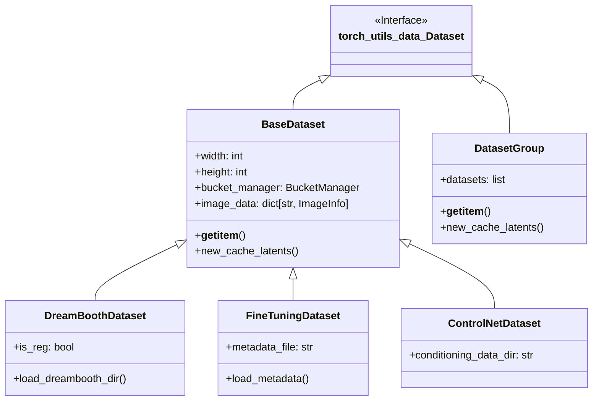
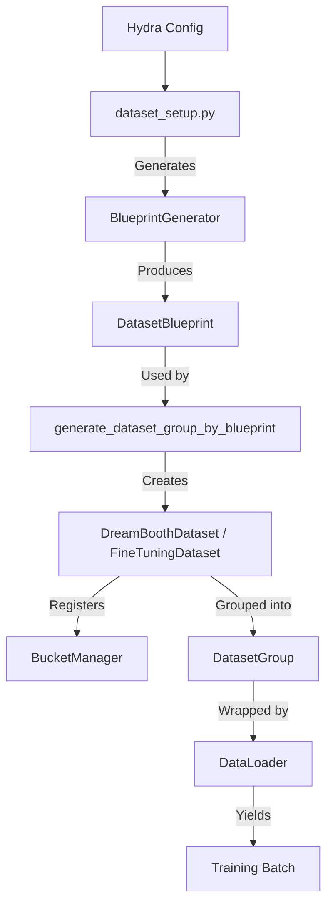
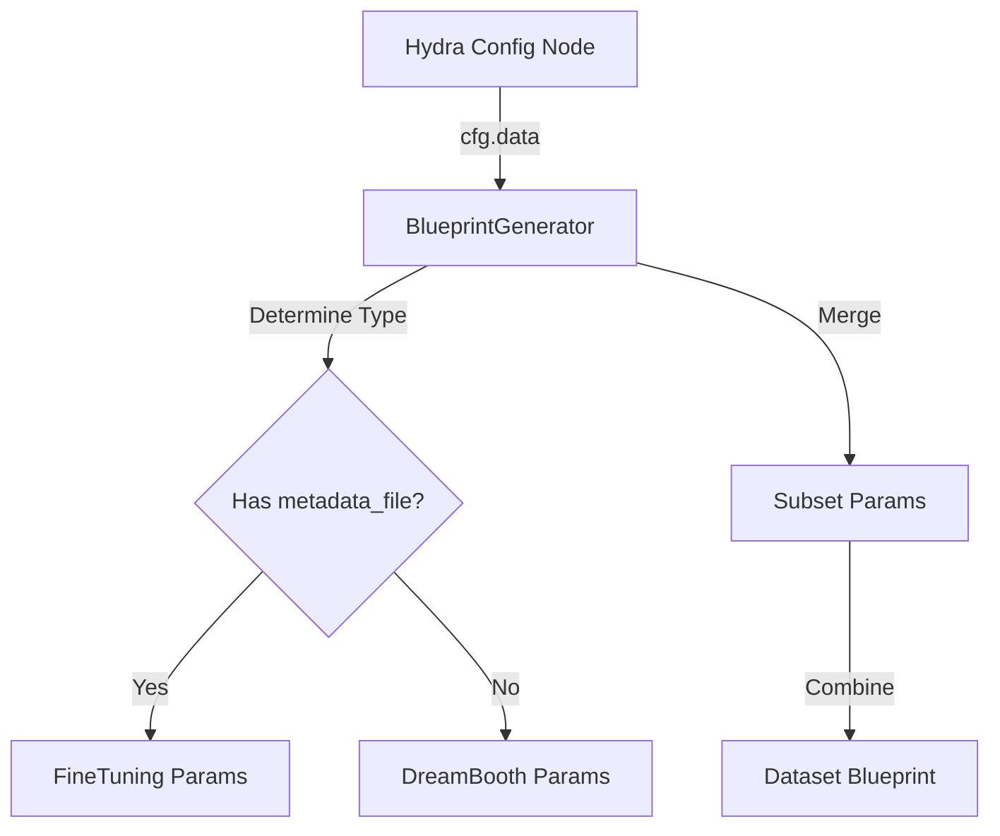

# Current Data Pipeline Documentation

This document describes the state of the data loading and caching system in `library/data/` and related modules as of the current codebase.

## 1. Core Classes & Data Flow

The data pipeline handles image loading, preprocessing, bucketing, and batching.

### Class Hierarchy

### Data Flow

1.  **Configuration**: User provides a config (Hydra/TOML) specifying dataset paths and parameters.
2.  **Blueprint**: `dataset_setup.py` uses `BlueprintGenerator` to convert config into a structural blueprint.
3.  **Instantiation**: `generate_dataset_group_by_blueprint` creates `DreamBoothDataset` or `FineTuningDataset` instances.
4.  **Bucketing**: `BucketManager` assigns images to resolution buckets.
5.  **Training**: `DatasetGroup` (ConcatDataset) serves batches via `DataLoader`.

### Key Classes

*   **`ImageInfo`**: The atomic unit of metadata for a single image. It holds paths, captions, latent cache data, and bucket info.
*   **`BucketManager`**: Handles Aspect Ratio Bucketing (ARB). It groups images of similar aspect ratios into buckets of defined resolutions to minimize cropping.
*   **`DatasetGroup`**: A wrapper around multiple datasets (e.g., training + regularization), acting as a `ConcatDataset`.

## 2. Configuration System

The configuration system bridges user input and dataset instantiation.

*   **`config_util.py`**: Contains `BlueprintGenerator` and config dataclasses (`DreamBoothDatasetParams`, `FineTuningDatasetParams`).
*   **`BlueprintGenerator`**:
    *   Reads `cfg.data` from Hydra.
    *   Determines if the dataset is DreamBooth, FineTuning, or ControlNet based on fields like `metadata_file` or `conditioning_data_dir`.
    *   Merges global settings (from `preprocessing`, `bucketing`) with subset-specific settings.

## 3. Caching System

The system aggressively caches intermediate results to speed up training, specifically VAE latents and Text Encoder outputs.

### Latents Caching (`LatentsCachingStrategy`)

*   **Logic**: If `color_aug` and `random_crop` are disabled, latents are deterministic and can be cached.
*   **Storage**: Saved as `.npz` files alongside original images or in memory.
*   **Format**: `.npz` contains `latents`, `original_size`, `crop_ltrb`, and optionally `latents_flipped`, `alpha_mask`.
*   **Flow**:
    1.  `prepare_datasets` calls `train_dataset_group.new_cache_latents`.
    2.  Images are loaded and passed to VAE.
    3.  Latents are saved to disk (if configured) or kept in `ImageInfo` memory.

### Text Encoder Caching (`TextEncoderOutputsCachingStrategy`)

*   **Logic**: Used for SDXL to cache the output of the two text encoders. Only possible if captions are static (no shuffling/dropout).
*   **Storage**: `.npz` files (suffix `_te_outputs.npz` or custom).
*   **Format**: Contains `hidden_state1`, `hidden_state2`, `pool2`.

## 4. Caption Processing

Captions are processed in `BaseDataset.process_caption`.

1.  **Loading**: From `.txt` / `.caption` files or JSON metadata.
2.  **Wildcards**: Supports `{a|b|c}` syntax for random selection.
3.  **Dropout**:
    *   `caption_dropout_rate`: Chance to drop entire caption.
    *   `caption_tag_dropout_rate`: Chance to drop comma-separated tags.
4.  **Token Warmup**: Gradually increases the number of tokens seen during early training steps.
5.  **Shuffling**: Randomizes the order of comma-separated tags if enabled.

## 5. Data Augmentation

Augmentations are applied in `__getitem__` if caching is disabled.

*   **Color Augmentation**: Adjusts hue, saturation, brightness (using `AugHelper`).
*   **Flip**: Horizontal flip (50% probability if enabled).
*   **Random Crop**:
    *   Standard random crop.
    *   **Face Crop**: Detects faces (via filename metadata) and crops around them.
*   **Alpha Mask**: Loads alpha channel for masking loss (e.g., for transparent images).

## 6. Multi-GPU / Distributed

*   **Dataset Splitting**: `DataLoader` splits the `DatasetGroup` across workers.
*   **Caching Coordination**:
    *   `new_cache_latents` and `new_cache_text_encoder_outputs` use `accelerator.process_index` to split the workload.
    *   Each GPU processes a subset of images `(i % num_processes == process_index)`.
    *   `accelerator.wait_for_everyone()` ensures all processes finish caching before training starts.

## 7. Known Pain Points

1.  **Performance**:
    *   Latent caching is slow (~8 it/s vs target 100+ it/s).
    *   `__getitem__` can be a bottleneck with heavy on-the-fly augmentation.
2.  **Complexity**:
    *   `ImageInfo` acts as a "god object" for image state, with unclear lifecycle management.
    *   `BlueprintGenerator` logic is hard to follow and modify.
    *   Duplicate logic exists between `DreamBoothSubset` and `FineTuningSubset`.
3.  **Caching**:
    *   Multi-GPU caching relies on file system synchronization which can be fragile.
    *   Re-validation of cache validity is expensive (loading `.npz` headers).

## Appendix: ImageInfo Field Summary

| Field | Type | Description |
| :--- | :--- | :--- |
| `image_key` | `str` | Unique identifier (usually path). |
| `num_repeats` | `int` | Number of times to repeat this image per epoch. |
| `caption` | `str` | Text prompt associated with the image. |
| `is_reg` | `bool` | True if this is a regularization image. |
| `absolute_path` | `str` | Absolute file path. |
| `image_size` | `tuple` | Original (W, H). |
| `resized_size` | `tuple` | Size after resizing for bucket. |
| `bucket_reso` | `tuple` | Resolution of the bucket assigned. |
| `latents` | `Tensor` | Cached VAE latents (in-memory). |
| `latents_npz` | `str` | Path to cached latents file. |
| `text_encoder_outputs` | `list` | Cached TE outputs (in-memory). |
| `alpha_mask` | `Tensor` | Alpha mask for transparency. |
| `latents_original_size` | `tuple` | Original image size stored with latents. |
| `latents_crop_ltrb` | `tuple` | Crop coordinates stored with latents. |
