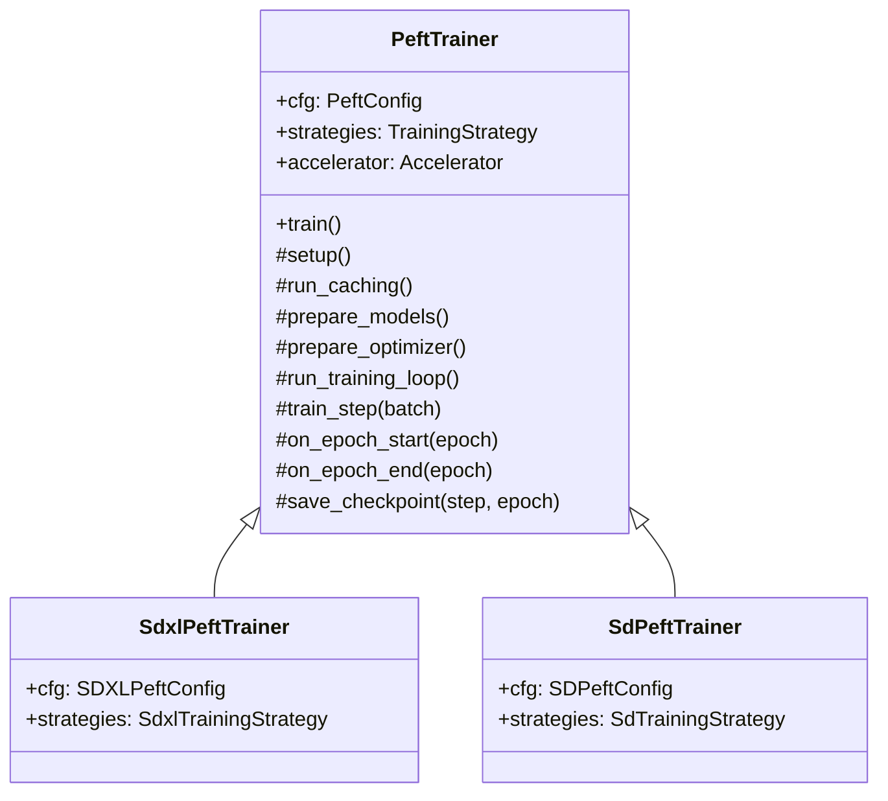

# Trainer Class Architecture Design

## Overview

This document proposes replacing the monolithic `train()` function (~1300 lines) with a **Trainer class** that cleanly separates orchestration (checkpointing, logging, progress) from model-specific logic (already in strategies).

## Design Goals

1. **Reduce script complexity** - Move from 1300-line function to ~100-line script
2. **Preserve strategy pattern** - Model-specific work stays in strategies
3. **Enable model extensibility** - Easy to add Flux, SD3, etc.
4. **Maintain Hydra integration** - Config injection via constructor
5. **Improve testability** - Instance methods easier to mock than nested closures

---

## Directory Structure

```
library/training/
├── trainers/
│   ├── __init__.py
│   ├── peft_trainer.py       # PeftTrainer class (~300-400 lines)
│   └── finetune_trainer.py   # FinetuneTrainer (future)
│
├── phases/
│   ├── __init__.py
│   ├── caching.py            # run_latent_caching(), run_te_caching()
│   ├── model_prep.py         # create_adapter(), configure_precision()
│   └── optimizer.py          # setup_optimizer_and_scheduler()
│
├── checkpointing.py          # (existing) save/load utilities
├── trainer_utils.py          # (existing) accelerator prep, grad sync
├── sample_generation.py      # (existing) sample_images_common
├── training_metadata.py      # (existing) metadata generation
└── ... (legacy files kept for backward compat)
```

## Class Hierarchy



> **Note:** Initially, `SdxlPeftTrainer` may just be an alias for `PeftTrainer` with no overrides. Subclasses exist for future extensibility, not immediate necessity.

---

## Responsibility Split

### PeftTrainer Owns (Orchestration)

| Responsibility            | Current Location    | New Location                |
| ------------------------- | ------------------- | --------------------------- |
| Accelerator setup         | `train()` L137-144  | `setup()`                   |
| Manifest creation         | `train()` L154-206  | `setup()`                   |
| Latent/TE caching         | `train()` L225-393  | `run_caching()`             |
| Model loading             | `train()` L404-661  | `prepare_models()`          |
| Optimizer/scheduler setup | `train()` L507-563  | `prepare_optimizer()`       |
| Training loop structure   | `train()` L907-1241 | `run_training_loop()`       |
| Checkpointing             | `train()` L767-795  | `save_checkpoint()`         |
| Progress bar              | `train()` L903-905  | `run_training_loop()`       |
| Logging/tracking          | Scattered           | `log_step()`, `log_epoch()` |

### Strategy Owns (Model-Specific)

| Responsibility          | Current Location                   | Stays In |
| ----------------------- | ---------------------------------- | -------- |
| `process_batch()`       | `strategies.process_batch()`       | Strategy |
| `load_target_model()`   | `strategies.load_target_model()`   | Strategy |
| `sample_images()`       | `strategies.sample_images()`       | Strategy |
| `get_noise_scheduler()` | `strategies.get_noise_scheduler()` | Strategy |
| `calculate_val_loss()`  | `strategies.calculate_val_loss()`  | Strategy |
| Caching strategies      | `SdxlLatentsPipelineStrategy`      | Strategy |
| Tokenization            | `tokenize_sdxl_captions()`         | Strategy |

---

## Core Data Structures

### StepOutput

Returned from `train_step()` to separate model math from loop policy:

```python
@dataclass
class StepOutput:
    """Output from a single training step."""
    loss: float              # Pre-scaling loss value for logging
    timesteps: torch.Tensor  # Timesteps used in this batch
    did_sync: bool           # True if gradients synced (global_step increments)
    metrics: dict = field(default_factory=dict)  # Optional extra metrics
```

**Why:** Keeps `train_step()` focused on computation. Loop policy (checkpointing, logging, validation) is decided by caller based on returned data.

---

## Instance State (Replaces TrainingContext)

```python
@dataclass
class PeftTrainer:
    # Injected at construction
    cfg: PeftConfig
    strategies: TrainingStrategy

    # Set during setup()
    accelerator: Accelerator
    device: torch.device
    weight_dtype: torch.dtype
    vae_dtype: torch.dtype
    tokenizers: list[Any]

    # Set during run_caching()
    train_manifest: DatasetManifest
    val_manifest: DatasetManifest | None

    # Set during prepare_models()
    unet: nn.Module
    vae: nn.Module
    text_encoders: list[nn.Module]
    adapter: nn.Module

    # Set during prepare_optimizer()
    optimizer: Any
    lr_scheduler: Any

    # Training state
    global_step: int = 0
    current_epoch: int = 0
    loss_recorder: EMARecorder
    val_loss_recorder: EMARecorder
```

**Key difference from TrainingContext:** State lives on `self`, not passed between functions.

---

## Method Details

### `__init__(cfg, strategies)`

```python
def __init__(self, cfg: PeftConfig, strategies: TrainingStrategy):
    self.cfg = cfg
    self.strategies = strategies
    # Minimal initialization - heavy lifting in setup()
```

### `train()` - Main Entry Point

```python
def train(self):
    """Main training entry point. Orchestrates all phases."""
    self.setup()
    self.run_caching()
    self.prepare_models()
    self.prepare_optimizer()

    self._log_training_info()
    self._maybe_sample_at_start()

    self.run_training_loop()

    self._finalize_training()
```

~15 lines. Compare to current 1300.

### `setup()` - Accelerator & Manifests

```python
def setup(self):
    """Initialize accelerator, tokenizers, and create dataset manifests."""
    set_torch_cuda_reduced_precision(self.cfg.performance.precision)
    set_seed_from_config(self.cfg.training)

    # Initialize strategies
    tokenize_strategy = self.strategies.get_tokenize_strategy(self.cfg)
    TokenizeStrategy.set_strategy(tokenize_strategy)
    self.tokenizers = self.strategies.get_tokenizers(tokenize_strategy)

    # Prepare accelerator
    self.accelerator = prepare_accelerator(...)
    self.device = self.accelerator.device

    # Prepare dtypes
    self.weight_dtype, self.save_dtype = prepare_dtype(...)

    # Create manifests
    self.train_manifest, self.val_manifest = self._create_manifests()
```

### `run_caching()` - Latent & TE Caching

```python
def run_caching(self):
    """Cache latents and optionally text encoder outputs."""
    if not self.cfg.data.caching.cache_latents:
        return

    # Load VAE for caching
    _, _, vae, _ = self.strategies.load_target_model(...)
    vae.to(self.device)

    # Cache latents
    engine = CachingEngine(strategy=self._get_latent_strategy(), ...)
    self.train_manifest = engine.cache_dataset(self.train_manifest, vae, ...)

    # Cache TE outputs if configured
    if self.cfg.data.caching.cache_text_encoder_outputs:
        self._cache_text_encoder_outputs()

    # Cleanup
    vae.to("cpu")
    clean_memory_on_device(self.device)
```

### `prepare_models()` - Load & Configure Models

```python
def prepare_models(self):
    """Load UNet, VAE, text encoders and adapter. Configure for training."""
    # Load models
    model_version, text_encoder, self.vae, self.unet = \
        self.strategies.load_target_model(self.cfg, self.weight_dtype, self.accelerator)

    self.text_encoders = text_encoder if isinstance(text_encoder, list) else [text_encoder]

    # Load/create adapter
    self.adapter = self._create_adapter()

    # Apply precision settings
    self._configure_precision()

    # Prepare with accelerator
    self._accelerator_prepare()
```

### `prepare_optimizer()` - Optimizer & Scheduler

```python
def prepare_optimizer(self):
    """Create optimizer, LR scheduler, and calculate training steps."""
    self.optimizer, self.optimizer_train_fn, self.optimizer_eval_fn, self.lr_descriptions = \
        prepare_optimizer(self.cfg.optimizer, ..., self.adapter)

    self._calculate_training_steps()

    self.lr_scheduler = get_scheduler_fix(...)

    # Handle resume
    self._resume_if_specified()
```

### `run_training_loop()` - The Core Loop

```python
def run_training_loop(self):
    """Execute the main training loop."""
    progress_bar = tqdm(range(self.max_train_steps), desc="steps")

    for epoch in range(self.epoch_to_start, self.num_train_epochs):
        self.current_epoch = epoch + 1
        self.on_epoch_start(epoch)

        train_dataloader = self._create_epoch_dataloader(epoch)

        for step, batch in enumerate(train_dataloader):
            self.train_step(batch, step)

            if self.global_step >= self.max_train_steps:
                break

            progress_bar.update(1)

        self.on_epoch_end(epoch)

    self._finalize_training()
```

### `train_step(batch, step)` - Single Training Step

Returns `StepOutput` instead of handling logging/checkpointing internally:

```python
def train_step(self, batch: dict, step: int) -> StepOutput:
    """Execute a single training step. Returns StepOutput for loop decisions."""
    with self._grad_sync_context():
        self.strategies.on_step_start(self.cfg, self.accelerator, ...)

        loss, timesteps = self.strategies.process_batch(
            batch, self.text_encoders, self.unet, self.adapter,
            self.vae, self.noise_scheduler, ...
        )

        self.accelerator.backward(loss)

        if self.accelerator.sync_gradients:
            self._clip_gradients()

        self.optimizer.step()
        self.lr_scheduler.step()
        self.optimizer.zero_grad(set_to_none=True)

    did_sync = self.accelerator.sync_gradients
    self._emit("on_step_end", loss=loss, timesteps=timesteps, did_sync=did_sync)

    return StepOutput(loss=loss.item(), timesteps=timesteps, did_sync=did_sync)
```

The **loop** handles policy decisions:

```python
# In run_training_loop:
output = self.train_step(batch, step)
if output.did_sync:
    self.global_step += 1
    self._maybe_checkpoint(step)
    self._log_step(output)
```

### `on_epoch_start(epoch)` / `on_epoch_end(epoch)`

```python
def on_epoch_start(self, epoch: int):
    """Called at the start of each epoch."""
    self.accelerator.print(f"\nepoch {epoch + 1}/{self.num_train_epochs}")
    self.accelerator.unwrap_model(self.adapter).on_epoch_start(...)

def on_epoch_end(self, epoch: int):
    """Called at the end of each epoch."""
    # Cleanup epoch token files
    if self._epoch_tokens_path and self._epoch_tokens_path.exists():
        self._epoch_tokens_path.unlink()

    # Maybe save checkpoint
    if self._should_save_epoch_checkpoint(epoch):
        self.save_checkpoint(self.global_step, epoch)

    # Maybe sample images
    if self._should_sample(epoch=epoch):
        self._sample_images(epoch)
```

### `save_checkpoint(step, epoch)`

```python
def save_checkpoint(self, step: int, epoch: int, final: bool = False):
    """Save model checkpoint."""
    if not self.accelerator.is_main_process:
        return

    ckpt_name = self._get_checkpoint_name(step, epoch, final)
    ckpt_path = os.path.join(self.cfg.output.saving.output_dir, ckpt_name)

    metadata = self._build_metadata(step, epoch)
    self.accelerator.unwrap_model(self.adapter).save_weights(
        ckpt_path, self.save_dtype, metadata
    )

    # Handle HuggingFace upload
    if self.cfg.output.huggingface.huggingface_repo_id:
        huggingface_util.upload(...)

    # Remove old checkpoints if configured
    self._cleanup_old_checkpoints(step, epoch)
```

---

## Script Becomes Thin

```python
# scripts/sdxl_peft.py

import hydra
from library.config.dataclasses.sdxl_peft import SDXLPeftConfig
from library.config.config_validation import prepare_config, validate_config
from library.strategies.sdxl.training import SdxlTrainingStrategy
from library.training.trainer import PeftTrainer  # or SdxlPeftTrainer

@hydra.main(version_base=None, config_path="../configs", config_name="sdxl_peft")
def main(cfg: SDXLPeftConfig):
    prepare_config(cfg)
    validate_config(cfg)

    strategies = SdxlTrainingStrategy()
    trainer = PeftTrainer(cfg, strategies)
    trainer.train()

if __name__ == "__main__":
    from library.config.schemas import register_sdxl_peft
    register_sdxl_peft()
    main()
```

~20 lines. Down from ~1350.

---

## Migration Path

### Phase 1: Create Base Structure

1. Create `library/training/trainer.py` with `PeftTrainer` skeleton
2. Move accelerator setup into `setup()`
3. Verify tests still pass

### Phase 2: Extract Caching

1. Move caching logic into `run_caching()`
2. Keep manifests as instance state

### Phase 3: Extract Model Prep

1. Move model loading into `prepare_models()`
2. Move adapter creation into helper method

### Phase 4: Extract Optimizer Setup

1. Move optimizer/scheduler into `prepare_optimizer()`

### Phase 5: Extract Training Loop

1. Move loop into `run_training_loop()`
2. Extract `train_step()` as method
3. Convert nested closures (`save_model`) to methods

### Phase 6: Cleanup

1. Delete original monolithic code
2. Update imports
3. Run integration tests

---

## Event Hooks (Future Extensibility)

Internal hooks provide extensibility without full callback system overhead:

```python
def _emit(self, event: str, **kwargs) -> None:
    """Internal event hook. No-op by default, override for extensions."""
    pass  # Future: dispatch to registered callbacks
```

**Hook points** (added now, no-op):

- `on_step_end` - After each training step
- `on_epoch_start` / `on_epoch_end` - Epoch boundaries
- `on_checkpoint` - Before/after saving
- `on_sample` - Before/after sampling

**Why now:** Zero runtime cost. When we need callbacks later, we just implement `_emit()` without touching the core loop.

---

## Future Considerations

### CheckpointIO / Backend Layer _(Deferred)_

For non-Diffusers serialization (GGUF, custom formats), separate save/load into a pluggable interface:

```python
class CheckpointIO(Protocol):
    def save_adapter(self, adapter, path, dtype, metadata): ...
    def load_adapter(self, path) -> nn.Module: ...
```

**Why defer:** No concrete second implementation yet. Will revisit when adding Flux or export formats.

### Protocol Types for Boundaries _(Deferred)_

Codify Strategy/Trainer split as Python Protocols for type checking:

```python
class TrainingStrategy(Protocol):
    def process_batch(self, batch, ...) -> tuple[Tensor, Tensor]: ...
    def load_target_model(self, cfg, ...) -> tuple[str, Any, Any, Any]: ...
```

**Why defer:** Interface still evolving. Add when we have 2+ model implementations.

---

## Open Questions

1. **Generic base vs SDXL-specific?**

   - Start with `PeftTrainer` that works for SDXL
   - Generalize when adding SD/Flux support

2. **Testing approach?**
   - Unit test individual methods
   - Integration test `trainer.train()` with small dataset

---

## Comparison: Before vs After

| Aspect            | Before (train function)   | After (Trainer class)    |
| ----------------- | ------------------------- | ------------------------ |
| Lines in script   | ~1350                     | ~20                      |
| State management  | Local variables, closures | Instance attributes      |
| Extensibility     | Modify function directly  | Override methods         |
| Testing           | Hard (nested closures)    | Easy (mock methods)      |
| New models        | Copy-paste + modify       | Subclass or new strategy |
| Hydra integration | Config passed to function | Config in `self.cfg`     |

---

## Implementation Progress

### Phase 1: Create Base Structure

- [x] Create `library/training/trainers/` folder with `__init__.py`
- [x] Create `library/training/phases/` folder with `__init__.py`
- [x] Create `PeftTrainer` skeleton in `trainers/peft_trainer.py`
- [x] Create `StepOutput` dataclass
- [x] Verify imports work

### Phase 2: Extract Setup Phase

- [x] Extract accelerator setup to `setup()` method
- [x] Extract manifest creation to `_create_manifests()` helper
- [x] Move dtype preparation to setup

### Phase 3: Extract Caching Phase

- [x] Create `phases/caching.py` with `run_latent_caching()`
- [x] Add `run_te_caching()` function
- [x] Wire into `sdxl_peft.py` (trainer wiring deferred to Phase 7)

### Phase 4: Extract Model Prep

- [x] Create `phases/model_prep.py` with `create_adapter()` function
- [x] Extract `configure_precision()` function
- [x] Wire into `sdxl_peft.py` (trainer wiring deferred to Phase 7)

### Phase 5: Extract Optimizer Setup

- [ ] Create `phases/optimizer.py`
- [ ] Extract step calculation logic
- [ ] Wire into trainer's `prepare_optimizer()` method

### Phase 6: Extract Training Loop

- [ ] Create `run_training_loop()` method
- [ ] Create `train_step()` returning `StepOutput`
- [ ] Convert `save_model` closure to `save_checkpoint()` method
- [ ] Add `_emit()` hook points

### Phase 7: Cleanup & Verify

- [ ] Update `scripts/sdxl_peft.py` to use new trainer
- [ ] Run unit tests
- [ ] Run integration smoke test
- [ ] Update CHANGELOG.md
