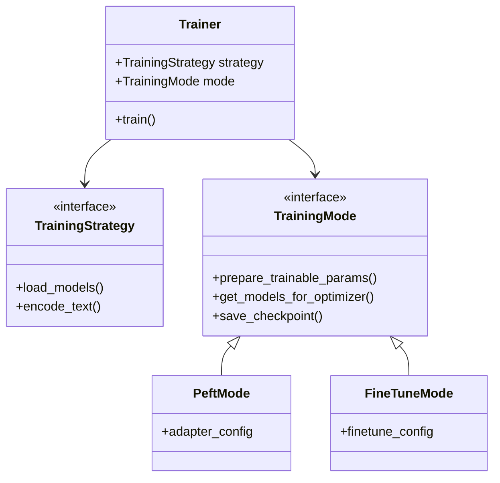

# Design Proposal: Unified Trainer Architecture

## 1. Executive Summary

This document proposes a **Unified Trainer Architecture** (Option A) as the recommended best practice for handling PEFT and Full Fine-Tuning modes within the project.

The current `PeftTrainer` is tightly coupled to the concept of an "Adapter" being the primary trainable object. To support Full Fine-Tuning without significant code duplication, we recommend introducing a **`TrainingMode`** abstraction.

This allows a single `Trainer` class (renamed from `PeftTrainer`) to orchestrate the training loop while delegating "what is being trained" to a specialized component. This aligns with industry standards (e.g., HuggingFace `Trainer`) where the orchestration layer is agnostic to the specific parameter optimization strategy.

## 2. Architectural Overview

### Current State
`PeftTrainer` directly instantiates and manages `self.adapter`. Phase functions explicitly type-hint `PeftTrainer` and access `trainer.adapter`.

### Proposed State
We introduce two distinct strategy layers:

1.  **`TrainingStrategy` (Existing)**: Handles **Model Architecture** concerns (SD vs. SDXL vs. Flux).
    *   *Responsibilities:* Loading models, tokenization, encoding, sampling, VAE scaling.
2.  **`TrainingMode` (New)**: Handles **Training Method** concerns (PEFT vs. Full Fine-Tuning).
    *   *Responsibilities:* Parameter freezing/unfreezing, optimizer group creation, model wrapping, checkpoint saving.

The `Trainer` class (formerly `PeftTrainer`) holds instances of both.



## 3. The `TrainingMode` Protocol

The `TrainingMode` interface abstracts all operations that differ between PEFT and Fine-Tuning.

```python
from typing import Protocol, Any, Iterable

class TrainingMode(Protocol):
    """Abstracts the specific training method (PEFT vs Full Fine-Tuning)."""

    def prepare_trainable_model(self, trainer: "Trainer") -> None:
        """
        Configure model gradients (freeze/unfreeze) and wrap models if necessary.

        - PEFT: Freezes UNet/TE, creates Adapter, sets adapter requires_grad=True.
        - FineTune: Sets UNet requires_grad=True, optionally TE.
        """
        ...

    def get_trainable_params(self, trainer: "Trainer") -> Iterable[Any]:
        """
        Return the parameters to be optimized.

        - PEFT: Returns `adapter.parameters()`.
        - FineTune: Returns `unet.parameters()` (and optionally `te.parameters()`).
        """
        ...

    def prepare_with_accelerator(self, trainer: "Trainer") -> Any:
        """
        Handle accelerator.prepare() for the model.

        Returns the prepared model (to be assigned to trainer._training_model).
        """
        ...

    def enable_gradient_checkpointing(self, trainer: "Trainer") -> None:
        """
        Enable gradient checkpointing on the relevant modules.
        """
        ...

    def save_checkpoint(self, trainer: "Trainer", path: str, metadata: dict) -> None:
        """
        Save the model state.

        - PEFT: Saves adapter state dict.
        - FineTune: Saves full UNet state dict.
        """
        ...

    def on_step_start(self, trainer: "Trainer") -> None:
        """
        Optional hook for mode-specific logic at the start of a step.
        (e.g., PeftModel.on_step_start hooks).
        """
        ...
```

## 4. Implementation Plan

### Phase 1: Rename and Abstract
1.  Rename `PeftTrainer` to `Trainer` (or `ModelTrainer` to avoid conflicts).
2.  Update type hints in `library/training/phases/*.py` to use `Trainer`.
3.  Inject `TrainingMode` into `Trainer.__init__`.

### Phase 2: Implement `PeftMode`
1.  Extract PEFT-specific logic from `prepare_models` (Phase 3) into `PeftMode.prepare_trainable_model`.
2.  Extract optimizer param grouping from `prepare_optimizer` (Phase 4) into `PeftMode.get_trainable_params`.
3.  Extract checkpointing logic from `Trainer.save_checkpoint` into `PeftMode.save_checkpoint`.

### Phase 3: Implement `FineTuneMode`
1.  Create `FineTuneMode` class.
2.  Implement `prepare_trainable_model`:
    *   Set `unet.requires_grad_(True)`.
    *   Handle Text Encoder freezing based on config.
3.  Implement `save_checkpoint`:
    *   Save full UNet state dict (safetensors).

### Phase 4: Config Integration
In `scripts/sdxl_peft.py` and `scripts/sdxl_finetune.py`:

```python
# scripts/sdxl_peft.py
mode = PeftMode(cfg.peft)
trainer = Trainer(cfg, strategies, mode)
trainer.train()

# scripts/sdxl_finetune.py
mode = FineTuneMode(cfg.training) # or cfg.finetune if added
trainer = Trainer(cfg, strategies, mode)
trainer.train()
```

## 5. Why this is Best Practice

1.  **Single Source of Truth:** The training loop logic (data loading, loss computation, backprop, gradient accumulation, logging) lives in one place (`Trainer.run_training_loop`). Fixing a bug in gradient accumulation fixes it for *both* modes.
2.  **Extensibility:** Adding a new mode (e.g., "Dreambooth with specialized prior preservation") becomes implementing a new `TrainingMode`, not copying the entire trainer.
3.  **Testability:** `TrainingMode` implementations can be unit-tested in isolation to ensure they return the correct parameters and handle freezing correctly.
4.  **Config-Driven:** The mode can be inferred from the configuration object, making the system robust to user input.

This approach provides the flexibility of Option B (Clean Separation) with the maintainability of Option A (Shared Logic).
