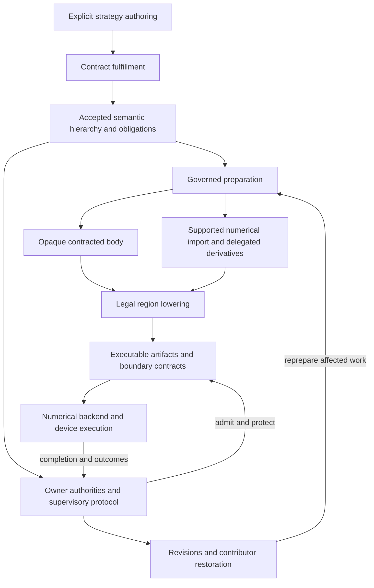

# Trainer architecture decision: supervised staged execution

Decision proposal for the model–strategy–Trainer rework · 1 October 2026

## Recommendation

Commit to **one accepted hierarchical semantic run graph, governed preparation, and execution through supervised, replaceable realizations**. Allow supported numerical computation to become transparent nested regions during preparation. Lower closed regions directly into executable programs; retain contracts and runtime facts at boundaries other owners actually need. Do not require a second persistent, backend-neutral executable control IR.

This selects candidate 3 below: a supervised staged program. Candidate 1 supplies its opaque fallback and first implementation slice. Candidate 2, a persistent control program interpreted or compiled by a distinct runtime, is demoted unless a concrete executor or reusable analysis requires it.

The resulting pipeline is:

`explicit authoring → contract fulfillment → accepted semantic hierarchy → governed preparation, including supported numerical capture/import → legality checking and lowering → executable artifacts + boundary contracts → supervised execution through existing numerical mechanisms`

The project owns accepted meaning, authorization, derivative routing, cross-owner lifetime constraints, admission, outcome correlation, revisions, and restoration composition. Existing frameworks own derivative formulas, tapes/residual storage, tensor operations, allocation, kernels, and ordinary backend communication. Optional planners can make numerical scheduling decisions using supported backend information without taking over those mechanisms.

This is an architecture proposal, not an amendment to the governing design or a production cutover. Final production shapes still follow G4/G5. Names in the records and pseudocode describe information, not proposed public classes.

## Authority, evidence, and what this decision changes

The supplied `design(4).md` governs. Its D1–D13 and G2.6/G3.1–G3.7 remain requirements. The sketch supplies pressure cases; the architecture report and adversarial review supply competing deductions. This proposal preserves the accepted-run boundary, one authority for participant/relationship state, separately owned run-state sections, standard Trainer mechanics, explicit changed-authority profiles, coherent preparation publication, and distinct artifact/restoration capabilities.

In particular, moving Trainer-owned backward or update mechanics into an executable generated by Trainer infrastructure is a **realization of retained ownership**, not a grant of those mechanics to a strategy operation. An ordinary operation still cannot acquire an optimizer handle or hide a second training loop. The authored strategy finishes its construction role after fulfillment; selected runtime policies and implementations continue to execute within their accepted scope.

The branch was inspected through GitHub at [e0a6f9bb2f7299bf576dfdd1cf5a1c6e8c9ac627](https://github.com/Enferlain/sd-scripts/tree/e0a6f9bb2f7299bf576dfdd1cf5a1c6e8c9ac627), which was the current `model-strategy-trainer` head and the commit used by both reports. Targeted source findings:

| Source evidence | Architectural implication | What it does not establish |
| --- | --- | --- |
| [execution.py](https://github.com/Enferlain/sd-scripts/blob/e0a6f9bb2f7299bf576dfdd1cf5a1c6e8c9ac627/library/training/execution.py) explicitly says it is not used by the active Trainer; `PreparedAction.execute` allocates slots and interprets operation wiring. | Those classes are experiments. Direct lowering can replace their execution structure. | A production contract, runtime ABI, or need for slot interpretation. |
| `RunCoordinator.tick` stops examining due work after the first `waiting` report. | A production independent-progress profile must avoid this head-of-line blocking; prebinding alone does not solve it. | That Python inherently cannot schedule independent work. |
| [advancement-policy test](https://github.com/Enferlain/sd-scripts/blob/e0a6f9bb2f7299bf576dfdd1cf5a1c6e8c9ac627/tests/unit/training/test_advancement_policy_experiment.py) isolates gradients with framework calls. Its routed values are 4 and 6; summed backward gives 16 and 8. | Loss-to-subject routing is semantic information, not an optimizer detail. Framework autodiff can realize it. | A need for a project autodiff engine or universal explicit pullback runtime. |
| [run-language tests](https://github.com/Enferlain/sd-scripts/blob/e0a6f9bb2f7299bf576dfdd1cf5a1c6e8c9ac627/tests/unit/training/test_run_language_experiment.py) retain one returned unit and one uncertain unit after a partial failure. | Lowerings must preserve the required per-unit knowledge and its input/attempt association. | Multi-input joins, real autonomous producers, or exact restoration. |
| [live loop](https://github.com/Enferlain/sd-scripts/blob/e0a6f9bb2f7299bf576dfdd1cf5a1c6e8c9ac627/library/training/phases/training_loop.py) still calls family batch behavior and mode hooks while performing generic optimization. | There is a concrete migration boundary; the experimental representation is not production structure. | Permission to retain the old strategy/Trainer dialogue. |
| [offload utilities](https://github.com/Enferlain/sd-scripts/blob/e0a6f9bb2f7299bf576dfdd1cf5a1c6e8c9ac627/library/performance/custom_offloading_utils.py) synchronize streams and rebind weight storage; the [CPU optimizer wrapper](https://github.com/Enferlain/sd-scripts/blob/e0a6f9bb2f7299bf576dfdd1cf5a1c6e8c9ac627/library/optimization/wrappers/cpu_offload.py) delegates to TorchAO. | Storage lifetime and transfer completion matter; existing mechanisms can remain delegated. | That a project memory planner is already necessary or faster. |

Recalculation from the [raw CPU probe results](https://github.com/Enferlain/sd-scripts/blob/e0a6f9bb2f7299bf576dfdd1cf5a1c6e8c9ac627/openspec/changes/rework-model-strategy-trainer/research/execution-cost-results.json) confirms the reported medians: 16 cheap operations take 14.406 μs in the candidate and 3.574 μs in matched direct Python. These are existing measurements, not new benchmarks. They support eliminating unnecessary interpretation. They do not prove a training speedup, native-runtime requirement, or a benefit from generated Python beyond ordinary specialization.

Only narrow external documentation was consulted to resolve differentiation and staging seams. No additional framework survey or new GPU/native/distributed benchmark was performed.

## 1. The canonical accepted information

The accepted graph is the canonical **program meaning**, not a container for every current runtime object. Its arrangement and obligation revisions govern realization. Current bindings, optimization state, input cursors, observations, and other state remain authoritative in their respective owner sections.

| Accepted information | Contents | Why it must be canonical |
| --- | --- | --- |
| Contract and authority | Contract/version, execution and ownership profile, run authority, arrangement revision, accepted obligations and evidence checkpoints. | There must be one interpretation of what the run permits and requires. |
| Participants and relationships | Incarnations, semantic substructure references, attachment/synchronization relationships, route meanings, view requirements, permitted lifecycle changes, lineage separately. | Physical wrappers, roles, and copied weights cannot redefine identity. |
| Hierarchical work | Selected implementations and static configuration; typed inputs/outputs; nested work; repetitions and accepted branches; activity lifetimes; due policies and progress meanings. | Whole-run behavior survives removal of the authoring interface. |
| Values and representations | Domain-defined compatibility meaning, producer/consumer association, logical grouping, gradient cuts/path requirements, cache substitution conditions. | Equal shape and queue position do not establish meaning. |
| Owned state and access | Owner, initialization, permitted updates, relevant dependencies, continuity rule, scoped effects, exclusive intervals and transferred-phase ownership. | Stateful algorithms and backend objects must not introduce a second writer. |
| Optimization | Unit incarnations/definition revisions, semantic membership, accepted loss/contribution routing, windows, sync/unscale/clip rules, advancement order or allowed partial order, scheduler and zeroing rules. | An executable must realize the specified gradients and cadence. |
| Handoffs and capabilities | Source/consumer relationship, work identity requirements, actual provenance, readiness/admission policy, backpressure/lifecycle bounds; capability declarations, requests, results and triggers. | Independently progressing owners need a contract beyond a value edge. |
| Change, outcomes and recovery | Permitted transitions, affected dependency meanings, state mapping rules, required observable outcomes/failure scopes, restoration contributors and allowable cuts/replay treatment. | Successful preparation is not a transaction around later execution. |
| Numerical selections | Selected algorithm/body identity and revision, meaningful precision/quantization and derivative policy, accepted alternatives and tolerances. | Lowering must not change the algorithm while claiming equivalent execution. |

An opaque implementation can be represented by a selected body reference plus its contract. A supported imported numerical body can be associated with that reference and checked assumptions. Capturing one observed path does not accept all arbitrary Python paths: specialization guards and accepted alternatives must account for the supported domain. An unsupported path remains an explicit fallback or fails readiness for a profile requiring capture.

Canonical does not require a universal serializable Python closure format. Exact restoration needs a reproducible selected implementation reference/version or a supported reconstruction mechanism; code distribution and serialization formats remain realization choices.

### Minimum vocabulary

Use the following meanings, without requiring one class for each row:

| Concept | Decision and derivation |
| --- | --- |
| **Participant and governed relationship** | Keep stable identity for independently managed participant state and for lifecycle-relevant relationships such as attachment. Roles and backend replicas are not new participants. |
| **Use** | Keep an invocation/use record: participant, required route/view, inputs/outputs, gradient behavior and effect requirements. Route is a callable binding meaning; view is scoped access or a use projection. Neither needs to be a separate executable node. |
| **Work region** | Merge operation/action/activity into one hierarchical work concept with boundary traits. An operation is a leaf; an action is a coordination boundary; an activity has independent lifetime/progress. These remain distinguishable traits without three universal execution engines. |
| **Value with representation contract** | Keep one value concept with structured ports and domain-defined representation. Do not invent a representation-conversion node unless real work performs a conversion. Logical examples, packs and microbatches are selected payload meanings. |
| **Owned state and version requirement** | Keep state owner and semantic dependencies separate from storage realization. Participant state, adaptive state, optimizer state, buffers, RNG and provider continuation can share this framing while retaining different owners. |
| **Typed relationship/constraint** | Keep value flow, order, state access/effect, version/admission and observation dependencies distinguishable. A universal untyped dependency is insufficient. Constraints can refer to other relationships and their intervals. |
| **Optimization unit and contribution** | Keep an independently advanced responsibility and an addressed contribution relation. Contribution is not necessarily a work node or one completed step. Loss-to-subject routing cannot be inferred from tensor identity. |
| **Differentiation demand and continuation contract** | Keep derivative targets, cuts and required lifetime semantics when externally relevant. An explicit runtime continuation handle is conditional, not mandatory for every eager forward. |
| **Handoff/admission relationship** | Keep request/product identity, actual dependency provenance and the selected admission/reissue policy. Admission and handoff can be relationship facts rather than mandatory executable nodes. |
| **Attempt and boundary outcome** | Keep invocation identity plus owner-supplied milestones, effects and outcomes. Completion is indexed by the activity/relationship/phase being completed; there is no universal success flag or global step identity. |
| **Transition and restoration contract** | Keep proposed change, accepted revisions, invalidation/state mapping, and contributor coverage. A restoration contributor is an owner interface plus cut requirements, not another participant or one graph node per saved field. |

This is eleven concept groups, not eleven primitive node types. Scheduling policies, preparation guards, resource credits and runtime implementations attach to these meanings. A general VM instruction vocabulary is not part of the semantic language.

### Relationships can constrain other relationships

For a shared forward, define an access relationship `read(a@v)` whose interval ends when continuation K no longer needs that state. The update relationship `write(a)` conflicts with it until that interval ends. A revision publication also depends on those same active uses being drained or isolated.

```python
read_a = access(use=forward, state=a, version=v, mode="read")
read_a.hold_until = last_use(K, required_requests)
conflict(read_a, access(use=update_U1, state=a, mode="write"))
requires(update_U1, window_complete(U1), synchronized(U1), clipped(U1))
```

The conflict and last-use relationships are constraints over accesses and completion facts. They are not artificial computations inserted between graph edges. Preparation resolves semantic scopes to physical aliases; unknown aliasing requires conservative exclusion or rejection. Actual copy, transfer, synchronization, or mutation can become physical work when execution needs it.

## 2. What must survive lowering

A boundary must remain enforceable when another owner must wait, exclude mutation, check a version, consume a result, observe an outcome, revise a realization, or participate in restoration. It can survive as a guard, scoped lease, continuation, completion token, owner report, source map, or compiled milestone. It need not remain a dispatched graph node.

| Boundary | Runtime information that survives | What may disappear from execution |
| --- | --- | --- |
| Independent input handoff | Actual work/dependency identities, selected payload/grouping, admission/reservation status and resource credits. | Provider-private worker graph and queue operations. |
| Prepared use | Executable generation, relevant binding/relationship/unit dependencies, protected live state and scoped access. | Authored names, graph traversal and repeated participant discovery. |
| Differentiated work | Outstanding derivative demands; backend-required versions/residuals; release conditions; compatible framework domain. | Public visibility of every tensor operation or every tape element. |
| Mutation and transferred authority | Owner/phase scope, exclusion interval, required clean handback, actual completion and uncertainty. | Individual physical kernels, provided the required milestones remain observable. |
| Observation/capability | Required observation order, actual result and external-effect status, consistency/view requirements. | Internal aggregation/traversal where no other owner depends on it. |
| Revision publication | Dependency checks plus synchronized admission/publication, drain/isolation, candidate evidence and owner installation. | Unaffected prepared structure; no full-graph rebuild is required with justified precise dependencies. |
| Restoration | Contributor state at an agreed cut, unfinished-work treatment, semantic identities/revisions and continuation rules. | Reconstructible preparation/compiler artifacts and physical object addresses. |

A closed region can compile away its internal wiring, branches, loops, and local values. The accepted graph remains available for meaning and inspection. Required source-to-executable provenance survives even where there is no runtime intermediate value.

The legality rule is **observational equivalence under the accepted profile**, including numerical/gradient policy, ownership, externally required ordering, partial-failure knowledge, revision behavior and restoration coverage. Fusion cannot silently turn “U1 returned; U2 uncertain; U3 unattempted” into “everything uncertain” when those separate facts are required. It must preserve the milestones or retain the corresponding boundaries.

Chunked loops likewise stop before an externally required observation, admission decision, revision, or snapshot point unless the executable itself supports that interaction. Private loops can disappear; externally visible opportunities to act cannot disappear by accident.

### Prepared contracts versus a second executable IR

A prepared realization needs this derived information:

```python
ExecutableBinding = {
    semantic_work: work_ref,
    prepared_generation: generation,
    depends_on: relevant_authority_and_unit_revisions,
    entry: callable_or_native_entry_or_backend_deployment,
    ports: resolved_boundary_layout,
    state_access: scoped_requirements_and_lifetimes,
    guards: representation_and_specialization_conditions,
    milestones: supported_completion_and_outcome_evidence,
    contributors: relevant_lifecycle_and_restoration_owners,
    provenance: semantic_to_physical_mapping,
}
```

This binding/manifest describes an executable and the conditions for using it. It does not contain a second interpretation of every branch, value dependency and dispatch sequence. Runtime readiness indexes and inflight records are derived coordination state, not another canonical program.

A persistent control IR becomes justified if a real consumer needs **executable structure beyond this contract**: for example, a deployed generic scheduler needs to interpret suspend/resume paths, or a reused analysis must transform the same prepared control program for two working lowerers. Inspection alone can use the semantic graph, lowering diagnostics and source maps. “It is backend neutral” or “we already have PreparedRun” does not justify it.

For the current requirements, no unique capability has been demonstrated that demands a universal persistent second IR. Use transient lowering representations freely. Cache or retain a backend execution program when useful; it stays rebuildable derived material and cannot acquire independent acceptance authority.

## 3. Three coherent end-to-end candidates

All three use the same canonical accepted graph and authority rules. They differ in what is materialized between acceptance and numerical execution. None uses the strategy authoring object as a runtime peer.

### Candidate 1 — direct lowering with opaque numerical bodies

**Pipeline:** authored strategy → accepted hierarchy with contracted body references → resolve participants/units and compile owner boundaries → direct executable functions or activity handlers plus prepared contracts → eager/compiled/backend numerical bodies.

| Stage | Concrete contents | Lifetime |
| --- | --- | --- |
| Authoring | Explicit participants, uses, selected functions, values, policies, unit declarations, effects and transitions. | Construction input. |
| Accepted representation | Canonical hierarchy/obligations; numerical bodies remain opaque behind derivative/effect contracts. | Retained accepted meaning. |
| Preparation/lowering | Coherent owner projection; alias/member resolution; guard/exclusion derivation; direct control emission; backend preparation. | Job and compiler structures are transient. |
| Runtime representation | ExecutableBinding per externally relevant work boundary; event handlers, joins, active access rights, unit windows and correlated attempts. No instruction program. | Prepared artifacts plus bounded live owner state. |
| Numerical execution | Framework forward/autograd/optimizer calls, or an already supplied backend executable. Internal tensors/tape stay backend-private. | Backend-owned realization and numerical state. |

```python
def lowered_action(admitted, scope):
    result = selected_body(admitted.payload, scope.current_views, scope.owner_state)
    check_declared_result(result)       # failure here is after possible effects
    scope.observations.deliver(result.observations)
    scope.optimization.apply(accepted_policy, result.contributions)
    return scope.outcomes()
```

The optimization owner supplies the standard mechanics implementation; `selected_body` does not receive it. Supervisor guards may be generated into the function. A closed local synchronous run can collapse supervisory work into these guards and scoped calls.

**Strength:** lowest implementation ownership, fast path, easy research extension and normal framework differentiation. **Ceiling:** contracts can protect opaque work but provide little visibility for joint numerical transformation, residual-specific release, or save/recompute/offload choices. Conservative lifetimes can unnecessarily delay updates. Opaque support remains necessary, but making opacity the only supported boundary would constrain the ambition.

Python is required if a selected body, policy or direct lowering is Python. It is not architecturally required: a supplied native backend body or direct native handler can implement the same contract. This candidate does not itself provide a capture/import route to create those bodies.

### Candidate 2 — persistent executable control program

**Pipeline:** authored strategy → accepted hierarchy → resolve and lower into a distinct backend-neutral control program plus numerical bindings → control executor interprets or compiles that program → numerical backend calls.

| Stage | Concrete contents | Lifetime |
| --- | --- | --- |
| Authoring and acceptance | Same canonical run meaning as candidate 1. | Accepted graph remains canonical. |
| Preparation | Resolved callable/route tables, port slots, control blocks, joins/awaits, access intervals, derivative requests, unit outcome points and provenance. | Builds a control-program generation. |
| Runtime representation | `ControlProgram` with executable branches/suspend-resume paths and resource rules; binding table; executor frames; readiness queues; owner state. | Control program is persistently retained for the prepared generation, though reconstructible. |
| Numerical execution | Contracted eager/compiled numerical bodies. Framework implements autodiff; executor orders supported requests and updates. | Backend-private math/tapes. |

An illustrative control fragment contains actual executable information:

```python
block action:
    inputs = await_join(feed_A, feed_B, accepted_work_identity)
    ticket = admit_and_protect(inputs, required_versions, access_scope)
    outputs, K = invoke(numerical_binding, ticket)
    g1 = request_derivative(K, output=L1, subjects=U1.members)
    contribute(U1, g1)
    await update_eligibility(U1, K.last_uses)
    invoke_unit_mechanics(U1)
    record_unit_milestone(U1)
    # Further requests/units and their failure boundaries remain explicit.
```

This requires a schema, verifier/lowerer and executor semantics for blocks, waits, forks, requests and outcomes. Compiling the program rather than interpreting it does not remove the cost of maintaining that second representation.

**Strength:** executor-independent suspend/resume structure, one place for supported control analyses, explicit scheduling representation. **Cost:** duplicated control encoding, schema evolution and potentially interpreter/FFI overhead. It still needs credible derivative/lifetime facts from the backend. Encoding `request_derivative` does not supply those facts or improve the derivative computation.

Python bodies still require Python regardless of the executor language. A native control executor is a separate realization decision; this candidate does not intrinsically remove numerical callbacks. It passes the pressure cases if correctly implemented, but they do not establish that its persistent instruction structure is required.

### Candidate 3 — supervised staged program with transparent numerical regions

**Pipeline:** authored strategy → accepted hierarchy with contracted selected bodies → coherent preparation, capture/import supported numerical work and obtain backend derivatives → transient transforms over control and numerical regions → direct executables/backend schedules plus boundary contracts → supported eager, compiled or native numerical execution.

| Stage | Concrete contents | Lifetime |
| --- | --- | --- |
| Authoring | Same explicit composition; a selected numerical body can offer capture/import support and state/derivative constraints. Authors do not need to write every tensor operation in the run language. | Construction input. |
| Acceptance | Canonical semantic hierarchy, selected body identity and numerical/ownership policy; opaque or supported transparent realization requirements. | Persistent accepted meaning, independent of a compiler's IR. |
| Preparation | Current participant/member mapping; captured/imported numerical graph; backend-generated forward/backward or pullback; alias/effect/replay summaries; specialization guards. | Imported graphs and planning IR are transient by default, optionally cached. |
| Transformation/lowering | Choose legal boundaries, specialize views/control, request backend differentiation/partitioning, fuse only compatible work, select optional memory/schedule variants, emit source maps and milestones. | Compiler work, not a second live authority. |
| Runtime representation | ExecutableBinding + actual executable artifacts; optional continuation descriptors; joins/access leases/attempt facts held by the relevant runtime owners. No mandatory universal control program. | Prepared generation and live state. |
| Numerical execution | Existing framework tape or backend-produced differentiated code. A fully supported prepared numerical region can execute without Python callbacks. Opaque or Python-hosted variants remain explicit alternatives. | Backend mechanisms and state. |

```python
job = derive_preparation(accepted_graph, coherent_owner_projection)
region = backend.capture_or_import(job.selected_body, job.state_mapping, job.guards)
derivatives = backend.differentiate(region, job.accepted_derivative_requests)
executable = lower_supported_region(region, derivatives, job.boundary_obligations)
verify_and_publish(executable, job)   # together with corresponding routes/units
```

Capture is performed under preparation rules. Discovery/tracing that executes code with effects cannot quietly mutate current run state: use provisional state or the declared destructive path, and account for RNG/buffers and external effects. Compilation never bypasses D8 publication.

**Strength:** retains candidate 1's direct execution and extension path, while leaving numerical structure available to legal transformations and optional planning. It covers the first-class authoring-to-executable pipeline without committing to a universal tensor IR, compiler toolchain or VM. **Cost:** importer/adapter support, guard and state mapping, numerical conformance, and compiler debugging. Unknown effects and unsupported operations constrain the supported subset.

Python can remain the authoring language and the repository language. During execution, Python is needed only by realizations that actually require it. A Python supervisor may launch a native program once; there need be no numerical callback into Python during that region. A stricter profile can require a native controller/entry as well. These are distinguishable guarantees.

**Selection:** choose candidate 3's envelope, implement candidate 1 as its first fallback path, and do not require candidate 2. Numerical import is an architectural extension seam; a production numerical planner or Python-free training backend is not a prerequisite for the first cutover.

## 4. Common pressure fixtures

The following fixtures are held fixed across all candidates. They are architecture traces and proposed test arrangements, not completed experiments.

### A. Ordinary training

Participants are the SDXL denoiser, required encoders and representation producer. Input and conditioning production yield compatible admitted values; cache substitution is allowed only under its accepted dependencies and gradient policy. Selected objective/prediction work produces an optimization source, accounting and observations. One unit owns the selected denoiser subjects and a declared contribution window, sync/unscale/clip/advance/zero policy. Objective feedback changes later sampling. Validation, trained-product persistence and runtime-snapshot requests have separate triggers/results.

### B. Differentiation and optimization pressure

One frozen participant F has a target view and a differentiable conduit view. A trainable side parameter `a` feeds its conduit, so frozen F must propagate gradients to `a`. A second disjoint unit owns `b`. Shared work uses `h = F(a)`; choose the simple oracle `F(a) = k*a`, with frozen `k=1`, and:

`L1 = h*b → U1(a)`; `L2 = h*h*b → U2(b)`.

At `a=2, b=3`, the authorized gradients are `(3,4)`. Summing both losses for both subjects gives `(15,6)` and must fail conformance. The target view is a separate accepted use of F, not a new participant. If view selection toggles mutable module state, incompatible uses are serialized and restoration is required.

Derivative request D1 can finish before D2. For the retention pressure, select a supported recomputation variant for D2 that still needs old `a` and F's relevant state after D1 returns. U1's gradient may be ready while its in-place update is forbidden. A second variant supplies an isolated old-state snapshot, allowing U1 to advance earlier if its window, clipping, synchronization and accepted order permit it. Unit-local clocks remain independent.

The late-failure fixture makes U1's advancement call return and U2's call mutate then raise without confirmation. Required outcomes are U1 returned, U2 uncertain, later unentered phases unattempted, with the same admitted input/attempt association. No automatic retry or multi-unit rollback is authorized.

### C. Whole-run coordination

An independently progressing encoder producer emits caption work out of order using a protected actual encoder state. A second input source produces representations. Training joins the intended pair by work/example identity, with actual dependency provenance, rather than queue order. One due consumer waits while unrelated ready work remains eligible. Queue/retained-resource bounds apply independently of training progress.

A stage request changes a teacher binding, a unit policy and an attachment-dependent view; owner-state continuation/reset rules are explicit. An unrelated encoder realization may survive with a justified precise dependency set. Products already produced remain admissible or become stale under their own rule. A destructive preparation variant mutates then fails, leaving affected guarantees withdrawn. An execution variant has uncertain optimizer mutation. Exact continuation requires a coherent owner cut, including produced/admitted/consumed work treatment; it is not proved by saving weights and cursors separately.

## 5. End-to-end traces for every candidate

### Candidate 1 under A

| Question | Concrete trace |
| --- | --- |
| Semantic graph | Input/representation/conditioning uses, cache cuts, objective state/feedback, one contribution relation and unit policy; validation/product/snapshot work with triggers and owners. |
| Preparation derives | Current routes for frozen and trainable participants; semantic-member-to-parameter correspondence; cache/readiness guards; direct calls and ownership-specific result handling. |
| Execution | Admitted input enters selected representation/conditioning and objective functions. Optimization-owned code performs framework backward and due unit mechanics; observation owner receives feedback. Due capabilities enter their own prepared work. |
| Surviving relationships and release | Input association, current-use rights, gradients/window state, observation ordering and unit outcomes survive. Conservatively protect numerical reads through backward; hold pending gradients to window completion. Input/temporary values release after their required consumers and backend completion, rather than merely after host return. |
| Failure | A selected-operation or malformed-result failure may have effects. A mutating optimizer failure gates affected state; capability writes report partial products independently. No action-success counter proves unchanged state. |
| Revision and Python | Weight advancement ordinarily reuses code while making dependent products stale as required. Relevant route/body/unit changes re-prepare direct bindings and affected owner state. Python is used for Python bodies/direct lowering; backend compilation can still optimize an opaque body internally. |

The ordinary path is clean and sufficient. No persistent control IR contributes a unique capability here.

### Candidate 1 under B

| Question | Concrete trace |
| --- | --- |
| Semantic graph | Two uses/views of F; differentiable path through frozen F; distinct loss-to-unit routes; independent windows and allowed update ordering; retention/exclusion requirements and per-unit outcomes. |
| Preparation derives | Physical alias/member checks and supported framework gradient isolation. Opaque body supplies a conservative retained-state contract; retain all potentially required old state until both derivative requests finish, unless a stronger backend contract proves less. |
| Execution | Direct owner code runs the shared numerical body, obtains D1 and D2 through framework autodiff, accumulates the addressed gradients and performs eligible mechanics. No naive loss sum. Framework tape composes the gradient path. |
| Surviving relationships and release | D1 readiness and U1 contribution can be reported separately. Old-state exclusion remains through D2's recomputation and asynchronous last use. U1 waits; isolated old-state storage can permit earlier update only if its contract is supplied. Mutable view switches require scoped restoration/exclusion. |
| Failure | U1 returned/U2 uncertain remains explicit in direct exception boundaries. Uncertain gradient/RNG/view state also gates its dependents. Tape release follows the supported failure cleanup, not blind replay. |
| Revision and Python | Changed gradient routes, view implementation or unit policy rebind/reprepare relevant code and gradient state; ordinary weights do not rebuild structure. Python is normally required by eager bodies and gradient glue; an existing native differentiated implementation could replace them. |

It is correct but can serialize unnecessarily. The smallest limitation is missing backend lifetime/schedule information, not inability to express the accepted meaning.

### Candidate 1 under C

| Question | Concrete trace |
| --- | --- |
| Semantic graph | Independent activity lifetimes and progress; two handoff relations with identity/provenance/admission; stage transition and contributor mapping; capacity and failure policy. |
| Preparation derives | Producer lifecycle handlers, join/admission checks, dependency-indexed wakeups, current-use exclusion and revision publication handlers; direct consumers with bounded attempt records. |
| Execution | Providers progress without a training action. Events update eligible joins. Waiting work yields; unrelated eligible work runs. Admission protects the actual selected current state using the same synchronization protocol as revision publication. |
| Surviving relationships and release | Provider credit returns when payload/storage is no longer needed by consumers or continuations. Producer state snapshots/leases establish actual provenance. Admission reservations remain correlated after partial failure; consumed is different from handed off. |
| Failure | Destructive preparation withdraws guarantees before mutation and leaves them withdrawn on failure. Uncertain execution stops unsafe dependent work; shutdown preserves the original error. Independent work continues only where the accepted failure profile permits. |
| Revision and restoration | Quiesce/isolate affected uses, settle or preserve/discard windows under the accepted rule, build/evidence-check candidates, jointly publish ready owner surfaces. Re-prepare affected routes/units and full overlapping backend groups. Restore from a contributor-complete cut; invalidate generation-specific handles. |
| Python | A local implementation can use Python handlers with async/process workers. Native handlers are possible; the chosen language must actually meet readiness/quiescence behavior. |

Candidate 1 does not reduce to one giant function under this case: its small supervisor has real joins, exclusion and lifecycle work. That work still does not require an instruction VM.

### Candidate 2 under A

| Question | Concrete trace |
| --- | --- |
| Semantic graph and preparation | Same A graph. Preparation additionally emits explicit control blocks for admitted input, selected calls, contribution/window decisions, mechanics, observations and triggers; resolves a binding table and port slots. |
| Execution | Executor follows control blocks, invoking numerical bodies and optimization-owned bindings. Unit windows and backend sync/scaling determine eligible advancement. |
| Surviving state and release | Access records and completion tokens remain in executor frames; slots release at derived last use. Tape/gradient lifetime remains framework-owned. |
| Failure | Control milestones retain operation effects and the unit's return/skip/uncertain knowledge; interpreter or compiled executor must preserve the same exception boundaries. |
| Revision and Python | Rebuild affected control blocks/bindings and publish a coherent generation; preserve unrelated valid blocks. Python numerical bodies still execute Python. A native interpreter adds crossings without automatically improving this ordinary case. |

It is a clean representation, but duplicates an executable sequence that direct lowering already supplies.

### Candidate 2 under B

| Question | Concrete trace |
| --- | --- |
| Semantic graph and preparation | Same B graph. Control program contains differentiated-call/request/contribution/update points, retained-version resource records and per-unit milestones. It must obtain the backend's real continuation requirements or use conservative access intervals. |
| Execution | Call forward, request D1, record U1 contribution, schedule D2, then dispatch eligible unit mechanics. A continuation may be a framework tape handle; executor does not implement chain-rule arithmetic. |
| Surviving state and release | Outstanding requests, unit windows and old-state leases remain in frames. Readiness of D1 does not close D2's read interval. Isolated snapshots or proven last use can discharge it. |
| Failure | Keep returned/uncertain/unattempted unit facts at explicit program points. Await and release operations honor supported device completion. Missing handback cannot advance retained mechanics. |
| Revision and Python | Rebuild affected derivative control/membership bindings on a relevant change; invalidate outstanding handles at the accepted safe boundary. Interpreter language and numerical-body language remain independent. |

The control program makes the schedule inspectable. It does not produce finer memory/recomputation choices when its numerical bodies provide only opaque summaries.

### Candidate 2 under C

| Question | Concrete trace |
| --- | --- |
| Semantic graph and preparation | Same C graph. Emit persistent producer/consumer state-machine blocks, multi-input joins, awaits, credit/exclusion rules and transition paths. Backend actors, if used, are bound implementations rather than canonical participants. |
| Execution | Executor schedules ready blocks; one awaiting frame does not block unrelated frames. Admission and revision publication use one protected protocol. Products carry actual numerical provenance and stage compatibility. |
| Surviving state and release | Inflight frame state correlates requests, products, admitted work, unit outcomes and completion. Resource rights survive asynchronous work; credits and generations release only at safe completion. |
| Failure | Destructive-path withdrawal and uncertainty gating remain identical to candidate 1. Runtime supervision/retry features cannot retry mutating calls outside accepted recovery rules. |
| Revision and restoration | Change affected program/binding generations, drain/isolate old frames and rebuild complete overlapping groups. Contributor snapshots restore semantic/owner state; physical program frames resume only if a declared restoration protocol supports them. Quiescent reconstruction is the default. |
| Python | Python executor or native executor with Python/numerical workers are both possible. A native VM is unnecessary unless this explicit program/executor proves useful for the actual deployment. |

This is its strongest case: a generic executor may need resumable control structure. Generated handlers or an existing event runtime can still implement the same semantics, so the case does not select candidate 2 automatically.

### Candidate 3 under A

| Question | Concrete trace |
| --- | --- |
| Semantic graph | Same A graph; body references can expose supported numerical structure. Meaningful cache and observation boundaries remain canonical even where numerical operations fuse. |
| Preparation derives | Current state/member mapping and guards; import supported conditioning/prediction/loss computation; request backend differentiation; choose a compiled boundary satisfying observation, update and failure obligations. Opaque representation/IO work may remain outside. |
| Execution | Direct handler admits input and invokes a staged numerical executable. Trainer-generated mechanics either call its derivative entry or are lowered into supported compiled work. Backend handles actual forward/backward and updates. Objective feedback and due capabilities remain at their required boundaries. |
| Surviving state and release | Boundary manifests retain inputs, selected views, state effects, unit windows, required observations and completion. Most internal call/value structure disappears from dispatch. Residual/gradient storage releases at backend-proven last use. |
| Failure | A compiled numerical call may fail after effects; preserve accepted outcome milestones. Separate mutation/update entries where required detail cannot be exposed inside one executable. Capability failures remain independently reported. |
| Revision and Python | A route or representation/gradient assumption change invalidates the affected artifact; weight updates reuse code when weights are runtime inputs. Python remains for unsupported policies/IO or a Python-hosted launcher; a supported native numerical body needs no Python callback within it. |

The first implementation can use candidate 1's opaque bindings. Transparent support increases the lowering ceiling without making the ordinary path depend on a new numerical compiler.

### Candidate 3 under B

| Question | Concrete trace |
| --- | --- |
| Semantic graph | Same B uses, cuts, demands, policies and outcomes. Backend-private numerical structure is nested beneath them, not promoted to public tensor nodes. |
| Preparation derives | Import shared forward and request framework-generated derivatives for the two authorized routes. Backend residual/replay/version facts distinguish D1 readiness from D2's remaining old-state need. Resolve physical aliases and mutable-view conflicts. |
| Execution | Forward produces outputs and a backend continuation or equivalent residual/state bundle. Execute D1; contribute to U1. Execute or schedule D2 under the old-state requirements. Update eligibility combines numerical last use with complete unit policy, rather than gradient arrival alone. |
| Surviving state and release | Continuation descriptor holds required versions/residual resources and outstanding requests. If D2 recomputes from live old `a`, block its in-place update. If D2 has an isolated snapshot, release the live `a` exclusion after D1's last use and allow early U1 advancement when otherwise authorized. Frozen F remains a gradient conduit. |
| Failure | Backward/transfer failure can leave gradients or owner state uncertain. U1 returned/U2 uncertain must survive compiled execution; keep separate entries or compiled owner milestones if fusion cannot preserve this detail. No automatic retry or state rollback. |
| Revision and Python | Relevant body/view/derivative/member assumptions reimport/recompile or choose another supported variant. Safe transition drains continuations unless a supported coexistence profile preserves them. Backend numerical code can be native; opaque custom operations may require Python and are disclosed in that variant. |

This is the strongest reason to permit numerical transparency. It makes better schedules possible while retaining delegated differentiation. It is not yet evidence that a custom planner will beat conservative framework composition.

### Candidate 3 under C

| Question | Concrete trace |
| --- | --- |
| Semantic graph | Same C lifetimes, two-source join, dependency/provenance admission, stage transition, failure and contributor rules. Numerical nesting does not replace the whole-run hierarchy. |
| Preparation derives | Direct event handlers and boundary contracts; compiled encoder/consumer regions where supported; actual version-protection mechanism; summary/budget contracts if an optional shared-resource profile is selected. No mandatory central control instruction list. |
| Execution | Producer runs its executable independently, tagging the protected state it actually used. Supervisor admits intended joined products and invokes consumer executables. Waiting work yields. Revision handlers coordinate the affected owners and current-use rights. |
| Surviving state and release | Join/reservation facts, generation/source dependencies, old-state continuations, mutation completion, capacity credits and owner outcomes remain runtime facts. Compiled producer math and private worker/control details can disappear. |
| Failure | Destructive preparation and uncertain execution retain the same safety paths as A/B. The compiler cannot advertise an unconfirmed state bundle or erase input reservations. Native execution changes neither uncertainty nor product durability. |
| Revision and restoration | Reimport/recompile only changed numerical assumptions; rebind/reprepare affected routes/units and complete overlapping groups; apply state migration/reset rules. Reject stale candidates at final publication. Snapshot at a declared cut covers providers, reservations, unit/owner/backend state and unfinished work; reconstructed artifacts carry new physical handles with preserved semantic identities. |
| Python | Python may handle selected schedules, IO and lifecycle while prepared numerical regions execute natively. Full controller isolation is a separately justified profile. Unsupported arbitrary Python is not forced through a compiler. |

This case remains a supervised activity system. Trying to compile its entire lifecycle into one tensor graph would discard the boundaries that give the architecture its meaning.

## 5a. Focused worked case: ordinary work beside a granted two-pass region

This case fills an omission in the concrete proposal: its traces describe standard differentiation and mutation but do not walk the G3.2/G2.5 changed-authority split through the recommended realization. It adds no new ownership profile, governing requirement, numerical-capture requirement or executor architecture.

**Established requirements** below come from design G3.2 and G2.5, with the existing preparation, current-use and correlation rules. **Proposed choices** describe one small realization of them. **Evidence still needed** identifies what this proposal has not demonstrated. The pseudocode is a readable trace, not an API definition or proof of backend support.

### Accepted meaning: one run, two kinds of action

Take participant M and one Trainer-owned optimization unit U selecting a semantic substructure S of M. The run has an ordinary action `train` and an explicitly granted action `two_pass`; an accepted due policy selects one of them using current coordinates and owned state. Both consume admitted inputs, use current prepared views and feed U's accepted advancement policy. They do not run concurrently against S.

An independent input producer and ordinary work on another participant N can progress on their own clocks. Validation or persistence reading M, another action updating U, and preparation/revision touching M conflict with the region's temporary edit. An outstanding derivative needing S's old storage also conflicts, even if its forward already returned. Work on N is independent only if its physical aliases, RNG, scaler and backend coordination resources are independently usable.

The **established narrow profile** has one due unit and a quiescent gradient window. It transfers two computations/backwards, first-gradient inspection, temporary parameter edits, intermediate gradient clear/replacement and restoration to the accepted executor. It retains final clipping and optimizer/scheduler advancement with Trainer. An unsupported grant or duplicate phase ownership fails fulfillment; a SAM wrapper that secretly advances the optimizer does not fit this split.

| Authored selection or declaration | Meaning accepted for this case |
| --- | --- |
| Selected ordinary computation and two-pass executor | Runtime implementations with their own declared boundaries; neither is the broad strategy-authoring interface. |
| Subject S, unit U and prepared-use requirements | Semantic participant/substructure and unit references plus dependencies. Raw parameter objects do not define the grant. |
| Exact requested phases | First and second computation/backward; first-gradient read; temporary edit/restore of S; intermediate reset of U's specified gradients. No final advancement handle. |
| Stateful perturbation rule | **Proposed example:** radius within accepted bounds depends on region-owned moving statistics and prior observations; zero first-gradient norm selects a zero perturbation, but still executes the second pass. Both branches have the same accepted authority. |
| State, RNG and computation effects | Region-owned statistics/counters and their initialization, observation inputs, dependencies and restoration contribution; explicit first/second-pass RNG and permitted buffer/view effects. Anything not covered by the offered profile must be rejected. |
| Handback and failure claim | Restored unperturbed view, usable second-pass gradients and accounted effects, correlated with the current attempt. No generic rollback or retry; exact snapshots only at coordinated quiescent, unperturbed boundaries. |

Changing a permitted radius, branching on the current first gradient, or updating region-owned statistics is ordinary accepted execution. It does not require numerical capture, recapture, graph amendment or an authoring callback. A branch that requests a different subject, an extra optimizer step or authority outside the accepted profile cannot execute under this grant.

### Preparation: make that grant executable before entry

**Established:** governed realization must establish current binding/route and unit dependencies, backend access, exclusion, synchronization/scaling compatibility and a restorable edit. The full preparation result publishes with the corresponding owner surfaces; acceptance alone does not establish readiness.

**Proposed realization:** retain the existing executable binding and attach the region's scoped phase/access requirements to it. Prepare the selected executor as an opaque callable if that is the supported implementation. There is no need for an imported tensor graph or a separately prepared Trainer.

The custom executor receives:

- Admitted batch values and changing coordinates, with attempt identity.
- Current scoped prepared routes/views and the selected computation needed for each pass.
- A checked realization of S and access to only the specified unit gradient storage.
- Backend backward/gradient services limited to the granted passes and intermediate reset, with the accepted synchronization/scaling behavior.
- Its own accepted state/RNG projections and permitted observation/effect reporting.

It receives no whole Trainer, unrestricted binding authority, unit-definition setter, optimizer or scheduler advancement handle, input-provider control or run-level scheduling interface. Physical handles and closures still rely on trusted implementation conformance; this is not a sandbox against hidden mutation.

Before execution, preparation must resolve or conservatively cover physical aliases, flattened/master/offloaded representations and inseparable backend groups affected by edits. It must establish how the pre-edit state is retained and restored, which computations/readers must drain, and what completion establishes safe edit/restore. Capability readers and exact snapshots share the same exclusion protocol. A backend that cannot support this scope fails readiness before invocation.

### Readable execution trace

The following is one **proposed direct-handler realization** of the established phase split. The accepted dependencies and backend guarantees, rather than the numbered list itself, govern legality.

| Point | Owner and execution | Protection, evidence and permitted next work |
| --- | --- | --- |
| 0. Ordinary action | Trainer admits input, invokes accepted ordinary computation, performs standard backward and unit mechanics. | Ordinary effects/outcomes remain correlated. A failed ordinary action cannot be erased by scheduling a research region next. |
| 1. Select region | Due-policy owner selects `two_pass`; run coordination checks current readiness and admitted input. | Verify U has no pending accumulation. Drain/exclude conflicting readers, continuations and writes; no silent clearing of an earlier window. |
| 2. Enter and initialize | Coordination acquires the exclusive interval; Trainer performs initial gradient clear. | Protect S, specified gradient storage and any relevant shared backend state before the region can mutate them. Bind access and grant to the attempt/current revisions. |
| 3. First pass | Custom executor runs selected computation/backward, reads the supported first gradient and updates only declared owned state. | The backend must supply the gradient interpretation required by the perturbation rule. First-pass residual/device work must no longer depend on storage that will be edited, or remain protected in a supported isolated representation. |
| 4. Branch and perturb | Executor chooses the accepted radius/direction from current gradients/state, then temporarily edits S. | Retain the pre-edit state under the prepared restoration mechanism. Mark the edit as potentially entered before starting it; an exception during the edit cannot be classified as pre-mutation. No other owner sees the temporary parameters. |
| 5. Intermediate reset | Executor clears/replaces the specified first-pass gradients. | This is its granted intermediate reset, not Trainer's initial/final zeroing. Other units' gradients and prior windows are outside its scope. |
| 6. Second pass | Executor computes/backpropagates using the perturbed view and accepted RNG/state policy. | Keep exclusion while derivative/device work needs that view. A non-finite/invalid result follows the supported failure or skip policy; it is not an implicit successful handback. |
| 7. Restore | Executor restores the prepared unperturbed view after its required last use. | Restoration must not race second-pass backward or transfers. Preserve the final second-pass gradient, not the first gradient or a sum accidentally accumulated across passes. |
| 8. Handback | Executor supplies effect/completion facts; Trainer/backend owners check them against the same attempt and protected revisions. | Parameter/view restoration, second-gradient readiness and region effects are separate evidence. An exception, missing evidence or stale handback does not authorize advancement. |
| 9. Retained mechanics | Trainer performs remaining accepted unscale/sync work if assigned there, final clipping, optimizer/scheduler advancement and final gradient cleanup. | **Proposed:** retain exclusion through these mechanics. Do not release then race another action between handback validation and update. Actual mechanics report their own returned/skipped/uncertain outcomes. |
| 10. Settle and release | Relevant owners record unit/action progress, observations, triggers and effects; coordination releases rights when completion permits. | Temporary edit/restore does not rebind M or revise U. Failure still uses the reached phase's outcome rules. Snapshot requests need the complete contributor cut, not just a released parameter lock. |

Trainer does not execute a second standard backward on the handback. For this action, the region has already supplied the final gradient through its granted phases. The ordinary action continues to use Trainer-owned backward. The common mechanism selects accepted work, protects its uses, invokes its implementation, checks owner-to-owner results and settles the retained mechanics according to that action's ownership profile.

### What counts as safe handback

**Established:** a success Boolean is insufficient. Before advancement, the receiving owners need evidence for all of the following, not merely parameter restoration:

| Fact | Required evidence and outstanding implementation issue |
| --- | --- |
| Correct attempt and current scope | Match action/phase, grant, participant/binding/route, obligation and unit dependencies. Exclusion protects the interval; checking revisions again alone cannot repair an unprotected race. |
| Unperturbed current view | Establish restoration of every relevant physical representation and temporary view effect. **Proposed local path:** a backend-supported saved pre-edit copy and completed restoration over checked members/aliases. A restore call returning or subtracting the intended perturbation alone is not universal proof. |
| Valid second-pass gradient | Confirm its subject/window correspondence, first-gradient replacement and accepted scaling/synchronization state. Define which owner completes remaining sync/unscale before clipping. The common-frame proposal has not yet specified this evidence exchange. |
| Completed numerical lifetime | Establish that backward/transfer work no longer uses the temporary view and that restoration/gradient writes have reached the required completion milestone. Host return is sufficient only under an adequate synchronous contract. |
| Accounted region effects | State/RNG/buffer/view and observation facts follow their declared owners and outcome rules. Restored parameters do not imply unchanged buffers, RNG or region statistics. |

A local restoration check may be sufficient for its declared trusted/backend profile; it does not establish distributed or hidden-effect safety. Whether a particular scaler can support two backwards, perturbation-gradient interpretation and intermediate reset without an invalid second unscale is **evidence still needed**, not a reason to grant the region a whole optimizer. The same applies to sharded/master/offloaded state. Unsupported combinations must remain unready.

### Failure: retain exclusion or quarantine, not a success-shaped release

**Established:** the final Trainer step cannot proceed after a failed region, even if parameter cleanup succeeds. Unusable state is determined by effects and dependencies, not by a zero action-progress increment.

| Failure | Unusable or unproven state | Work that must stop; possible established continuation |
| --- | --- | --- |
| First pass fails before perturbation | Gradients, input consumption, RNG, buffers and region-owned state may have changed; parameter perturbation has not been entered if that fact is established. | No second pass/final step or blind retry. Gate consumers of affected owner state; re-establish only under an accepted recovery rule. |
| Perturbation or second pass fails; restoration is subsequently evidenced | The action and its final-gradient handback remain failed. Restored parameters can regain usability only after all required view/completion facts are checked; gradients and other owner effects still need resolution. | No final clipping/advancement or action-success record. A narrower recovery must account for input, RNG, state and gradients as well as clean parameters. Cleanup success is not action success. |
| Restoration fails after partial writes | Current parameter/view contents are uncertain; associated gradients and backend representations may also be inconsistent. Retain the saved state if useful for accepted recovery, not as proof of rollback. | Stop standard/research actions, validation/sampling/product reads, preparation publication and outstanding continuations depending on affected state. Withhold exact snapshots of this live state. Unrelated work can continue only where the accepted failure policy and actual resource isolation permit it. |
| Executor returns but handback is missing, malformed, stale or uncertain | The receiver lacks a current-use guarantee for restored views and/or final gradients; reported success cannot close that gap. | No retained advancement. Protect affected access until usable facts are re-established or recovery takes over. A narrower established restoration fact need not be discarded, but it cannot substitute for missing gradient/effect facts. |
| Trainer optimizer/scheduler/cleanup fails after valid handback | The region's restoration facts remain known; later unit/gradient/scheduler state follows G3.1's reached-call uncertainty. | Preserve separately known outcomes; stop unsafe dependents. No claim of a two-pass transaction or numerical weight-change proof. |
| Process/rank loss | The live attempt cannot establish completed restoration or handback. | Restore the last coherent same-run cut with the accepted input and contributor state, or report continuation unavailable. No mid-region resumption claim. |

**Proposed implementation choice:** an active exclusive interval must settle either into established usable state or into withheld usability for the affected dependencies. Throwing an exception or dropping a lock must not make the perturbed objects available again. This is an execution-failure path under the existing usability rules, not an automatic participant revision or a claim of D8 preparation rollback. After coherent restoration, re-prepare affected physical bindings as required; identity continuity follows the existing rules.

Independent producer progress is not automatically unsafe, but products derived from perturbed M cannot be admitted as if they came from its normal state. This case prevents such reads rather than inventing a transient policy version for them. Ordinary input production from isolated frozen encoders may continue subject to capacity and the run's accepted failure policy.

### Limited pseudocode: one direct handler and a bounded executor

```python
# Meaning sketch: same participant/unit, different accepted phase owners.
ordinary = accepted_action(body=ordinary_body, ownership="standard", unit=U)
research = accepted_region(body=two_pass_body, ownership=offered_two_pass_split,
                           subject=S, unit=U, state=region_state)
# The same due/admission/preparation/outcome machinery runs either selection.

def handle_research(work, binding):
    attempt = admit_current_work(work, binding)
    interval = protect_scope_and_check_quiescent_window(attempt)
    try:
        trainer_initial_clear(U, attempt)
        handback = binding.invoke(scoped_access(attempt, interval))
        verify_handback_with_relevant_owners(handback, attempt)
        trainer_clip_advance_schedule_and_clear(U, attempt)  # no extra backward
        settle_from_owner_facts(attempt)
        interval.release_when_completion_allows()
    except BaseException as primary_failure:
        # Preserve restoration facts/primary failure; withhold what is unproven.
        gate_affected_use_before_releasing_exclusion(attempt, interval)
        record_owner_outcomes_and_coordinate_failure(attempt, primary_failure)
        raise

def two_pass_body(scoped):
    first_gradient = scoped.compute_and_backward(pass_id=1)
    radius = scoped.own_state.choose_within_accepted_bounds(first_gradient)
    saved = scoped.retain_pre_edit_state()
    # The scoped edit tracks possible mutation before entering backend work.
    primary_failure = None
    try:
        scoped.temporary_edit(saved, radius, first_gradient)
        scoped.intermediate_gradient_reset()
        scoped.compute_and_backward(pass_id=2)
    except BaseException as error:
        primary_failure = error
    # Attempt restoration even after failure; report cleanup failure separately.
    restoration = scoped.attempt_restore_after_required_last_use(saved)
    if primary_failure is not None or not restoration.established:
        scoped.fail_with_effect_facts(primary_failure, restoration)
    return scoped.handback_facts(restoration)  # successful passes and restoration
```

The scoped operations stand for preparation-checked backend services and selected behavior, not a new API or numerical runtime. Here the restoration attempt reports errors as facts, and `fail_with_effect_facts` terminates the invocation while preserving both primary and cleanup failures. That reporting contract still needs implementation evidence. First-gradient reads and state changes must be tracked even if saving/edit setup fails. The outer handler's failure path covers exceptions after effects, including bad handback or later retained mechanics; its gating/reporting must itself fail closed and preserve those failures. A two-pass implementation cannot loop over batches, choose subsequent run actions or invoke final advancement through this scope.

### Do direct handlers suffice? What retained structure would help?

For this bounded, synchronous two-pass region, **direct handlers suffice in principle**. The authored hierarchy and prepared contracts retain phase ownership, access scope and outcome obligations; structured control inside the accepted executor implements the two passes and restoration. An opaque Python executor can branch and maintain state without numerical capture. Its host `finally` still needs the correct backend completion and failure protocol—it is not itself the evidence of restoration.

Retained executable phase structure could help if a supported implementation yields while backward/restoration completes, or if a shared executor needs to know whether an inflight attempt is before edit, perturbed, restoring or awaiting handback. That can improve completion routing and inspection. A small attempt-held phase record may supply those facts without retaining a universal instruction program. The requirement is to preserve relevant phase/effect knowledge, not to record every private branch or tensor operation.

This worked case therefore **does not choose a persistent control IR**. It exposes concrete gaps to close in the existing proposal:

1. The generic access/manifest framing lacks a precise entry-to-handback-to-retained-advancement protection protocol, including partial acquisition, cancellation and failed cleanup.
2. Ordinary contribution handling lacks an explicit alternative for an already-produced gradient handback; it must not accidentally run standard backward again.
3. Restoration and gradient/scaling/synchronization evidence are still abstract. Realization must define their producer, verifier and completion facts for each supported backend.
4. The generic failure description does not specify how active exclusion becomes withheld usability or how dependency fan-out gates validation, preparation, snapshots and outstanding derivatives after uncertain restoration.
5. Region-state/RNG/input/effect outcomes and their quiescent restoration contribution need composition tests. A same-process parameter copy-back test alone cannot establish exact continuation or distributed exclusion.

These are missing exchanges and evidence in the proposed mechanism. They can be addressed using its existing work, access, attempt/outcome and contributor meanings; no separate Trainer, unrestricted callback or additional speculative abstraction is justified by this case.

## 6. Transparent numerical and differentiated regions

### Numerical transparency: permit it now, require it only for selected profiles

A transparent nested numerical region exposes enough supported structure for a compiler/backend to analyze and transform its body. It can contain an existing framework IR with ports, parameter/buffer/state mappings, aliases/effects, differentiation and specialization assumptions. The semantic run graph need not understand its operator set.

The project must know which transformations are authorized and which assumptions affect current use. It does not need to implement the tensor IR's general verifier, differentiation rules or code generator. An adapter can forward backend analyses, derivative requests and transformation options. Framework internals accessed by that adapter require a pinned compatibility policy and conformance tests.

Import may cover one invocation, several selected numerical uses, or an entire compatible numerical action. It can include control over those uses and Trainer-generated optimization mechanics. Import must stop at unsupported or externally relevant effects unless they have an explicit supported interface. Treating a Python callback as an opaque imported operation is possible, but does not make that operation Python-free.

The exact first-class path under investigation is therefore admitted by the architecture:

`Python-authored selected numerical behavior → accepted body/use/ownership contracts → capture/import forward and framework-generated derivatives → transform supported control + numerical work → native/compiled executable with protected runtime state and owner-visible milestones`.

Three guarantees must be named separately:

| Guarantee | Required evidence |
| --- | --- |
| No strategy-authoring callback | Execution still works after the authoring interface is released. Already a governing requirement. |
| No Python callback **inside a prepared region** | Trace or counter establishes that numerical operators, derivatives, hooks and region control do not call Python after preparation. A Python caller outside the region is allowed. |
| No Python runtime in the deployment/profile | Native entry, guards, completion/exception handling and all selected region/runtime services work without a Python interpreter. Stronger and optional. |

Narrow prior-art checks resolve feasibility, not the backend selection. PyTorch's [custom backend interface after AOTAutograd](https://docs.pytorch.org/docs/2.14/user_guide/torch_compiler/torch.compiler_custom_backends.html#custom-backends-after-aotautograd) exposes framework-generated forward/backward graphs to compiler hooks. This supports importing differentiated structure without implementing derivative formulas. It does not certify this trainer's state/view/optimizer contracts.

Its [AOTInductor documentation](https://docs.pytorch.org/docs/2.14/user_guide/torch_compiler/torch.compiler_aot_inductor.html) demonstrates exported models compiled for non-Python C++ execution. That demonstrates the authoring/runtime distinction, not complete arbitrary training deployment. Separately, [AOT compilation with torch.compile](https://docs.pytorch.org/docs/2.14/user_guide/torch_compiler/torch.compiler_aot_compile.html) supports training-aware compilation but reloads a Python callable. Therefore choosing an AOT API by name is insufficient proof of a Python-free training path. The small differentiated-region prototype below must establish the actual supported route.

### A continuation is a lifetime contract, not another autodiff engine

Use `forward → outputs + differentiation continuation` when forward and derivative work cross an independently scheduled or retained boundary. It is a useful common contract for candidate 3. For a closed eager action, the framework tape can realize the same meaning implicitly; no wrapper object needs to be allocated solely for uniformity.

```python
ContinuationDescriptor = {
    attempt_and_generation: (...),
    outputs: structured_output_ports,
    permitted_requests: output_cotangents_and_subject_routes,
    retained_requirements: state_versions_residuals_and_storage_rights,
    outstanding_requests: request_set_or_supported_usage_rule,
    replay: allowed_recompute_state_rng_and_effect_conditions,
    completion: request_readiness_and_last_use_tokens,
    release: supported_dispose_or_cancel_protocol,
    backend_handle: tape_or_residual_bundle_or_native_handle,
}
```

The fields are semantic requirements, not a universal object layout. A backend may represent the continuation as saved tensors, compiled residual buffers plus a backward entry, a framework pullback, or a task-local tape. PyTorch's [vjp](https://docs.pytorch.org/docs/2.14/generated/torch.func.vjp.html) returning outputs and a cotangent-driven pullback is a concrete example of the basic forward/continuation shape. It does not automatically provide this proposal's version leases, release protocol, restricted subject routing, or split scheduling.

A derivative request names the relevant output/cotangent seed, requested semantic subjects or input ports, derivative order, accumulation destination/window and applicable numerical policy. Preparation resolves subjects and physical aliases. The backend must honor the request or reject readiness. For B, it computes D1 for `a` from L1 and D2 for `b` from L2; it does not sum the losses and rely on disjoint optimizers to repair the result.

A continuation may hold an old parameter version, a residual snapshot sufficient for the requested derivatives, or a replayable state bundle. These are different realizations. Not every forward read must remain protected until every backward: the backend may prove a smaller retained requirement. Without that proof, protect conservatively. Holding a generation identifier does not preserve numerical parameter storage.

The first explicit continuation profile should be bounded: first-order reverse mode in one compatible framework/backend domain, specified structured ports, no undeclared effects, and supported saved-state/replay rules. Higher-order derivatives, crossing framework/process domains, arbitrary mutable custom functions and split backward need separate support evidence. Keep ordinary framework autograd composition across nested regions whenever possible.

If the project starts composing cotangent propagation and chaining pullbacks itself, it has implemented a differentiation orchestration layer. That must be an explicit optional profile, not something hidden in “graph execution.” There is no pressure-case requirement to build that layer now.

Backends may optionally expose separate input-gradient and parameter-gradient tasks, batched requests, or rematerialization candidates. The run planner can constrain their order without writing derivatives. The default request remains a complete supported derivative operation; subdivision is not a universal promise.

### Update eligibility is a conjunction

```python
can_update(unit) = (
    unit.accepted_window_is_complete
    and unit.required_sync_and_unscale_are_complete
    and unit.accepted_clipping_is_complete
    and unit.accepted_order_allows_it
    and no_required_old_state_use_would_be_invalidated
    and prepared_unit_and_routes_are_current
    and all_required_prior_outcomes_are_usable
)
```

Parameter-gradient arrival alone is insufficient. Unit-global clipping, shared uses, pending recomputation, distributed reductions or incomplete accumulation can delay mutation. An optimizer-in-backward or parameter-local early-update variant is optional and may be rejected before execution. It cannot alter clipping scope, zeroing, cadence, outcome detail or phase ownership to gain memory savings.

In-place update remains the conservative profile: a call entered before failure may leave state uncertain. A non-donating functional profile may compute candidate numerical state while retaining the old state, then publish through the respective owners after required completion. Such a profile can offer stronger local failure behavior, but must account for buffers/RNG, input reservations, external effects and memory cost. Numerical candidate publication does not replace the run authority or make a run transaction. Do not require functional full-model state for the core.

### Version and release discipline

Keep these axes separate:

| Axis | Typical change |
| --- | --- |
| Arrangement/obligation revision | Accepted meaning or requirement changes. |
| Participant/binding/relationship/route revisions | Governed replacement, attachment or re-preparation changes current usability. |
| Unit incarnation and definition revision | Membership/policy meaning changes, or responsibility splits/recreates. |
| Executable generation and specialization | Recompile/rebind executable artifacts. |
| Numerical state version or protected access epoch | Ordinary weight/buffer evolution; actual state used by products/continuations. |
| Work/attempt/product identity | A new request, invocation or produced value. |

Numerical versions are owner-defined dependency tokens, not mandatory content hashes or proof that every returned optimizer call changed values. A potentially mutating call can invalidate usable-state guarantees even when its final numerical version is unknown. Producer provenance needs a credible protected state or snapshot actually used during computation; a label supplied before mutable weights change is insufficient.

Admission and revision publication must share synchronization. `check(g7); publish(g8); invoke old mutable objects` is a race. Use protected coherent projections, state leases or exclusion/quiescence. A code generation pin and a numerical storage/version right have distinct lifetimes.

Release occurs when required use completes, including queued device/transfer work. Host return is sufficient only for a synchronous contract that establishes the needed completion. Supported same-stream/device dependencies can establish ordering without globally synchronizing every call. Credit return, storage disposal, mutation eligibility and durable snapshot completion can occur at different milestones.

## 7. Cross-region planning and native coordination

### Put resource coordination in the core; numerical planning in an optional profile

| Responsibility | Placement | Reason |
| --- | --- | --- |
| Prevent conflicting state use; protect continuations; track relevant completion. | Core architecture. | Required for correctness in B/C regardless of optimization. |
| Bound producer queues and retained handoffs; apply conservative resource reservations/exclusion when needed. | Core support, with policy selected by the run/profile. | Independent producers cannot consume unbounded resources. No custom tensor allocator is implied. |
| Request backend memory/lifetime summaries and alternative realizations. | Optional supported preparation interface. | Enables better plans without requiring numerical transparency for all work. |
| Jointly choose retain/recompute/offload, budgets, transfer order, derivative partition and eligible update timing. | Optional execution/planning profile. | Credible value when independent numerical regions share a budget; no measured need to impose it universally. |
| Allocate individual tensors, implement saved-tensor storage or kernels, own framework device coherence. | Backend mechanisms. | Duplicating them creates competing storage authorities and a framework project. |

The smallest optional planner chooses among backend-offered coarse region variants and bounded resource envelopes. It can give the student a larger budget while the teacher or encoder is idle, or delay admission until an offload completion returns credits. It does not initially solve an operator-level global scheduling problem.

Deeper planning needs replay and effect facts: old parameters/buffers, RNG, mutable state, aliases, precision state and side effects. Repeating an adaptive update or recomputing with new weights changes semantics. Opaque implementations can participate with conservative reservations and fewer legal overlaps. If a backend already manages the entire closed action's memory/schedule, do not add a second planner to the same scope.

Memory summaries must state their guarantee. Measured peaks are estimates, not hard bounds. Compiler workspaces, allocator fragmentation, communicator buffers, live queues, parameter snapshots and optimizer staging all consume resources. Claim a hard shared-memory budget only with mechanisms and evidence capable of enforcing it; otherwise use conservative limits and explicit failure handling.

### Native coordination is conditional, and does not imply a VM

Native coordination would be justified by a supported workload showing material readiness/credit-return or quiescence delays after sensible host specialization and worker isolation, a real controller/deployment isolation requirement, or lower total integration complexity from an existing runtime.

Measure useful throughput, device idle gaps, queue residence/peak memory, p99 readiness and quiescence, callback crossings, preparation/revision latency and operational burden. A small CPU bookkeeping percentage does not rule it out if delayed coordination stalls devices. Conversely, a fast native queue does not make a synchronous Python body cancellable.

The runtime boundary is an event/authorization/completion protocol. It can be realized by Python handlers, native handlers, workers or an existing actor/event runtime. None requires a custom bytecode, instruction decoder or research-method opcode catalog. Native data structures must not duplicate mutable authority-owned binding or optimizer state in a second registry.

## 8. Architecture versus implementation and optimization

Each item receives a primary classification. Optional use still has to preserve the same accepted contracts.

| Idea | Classification | Decision |
| --- | --- | --- |
| Accepted hierarchical whole-run graph; ownership, admission, revisions and restoration contracts | Foundational architectural requirement | Commit now. Preserve canonical meaning and owner boundaries independently of runtime technology. |
| Supported transparent numerical nesting and import contract | Foundational architectural requirement at the extension boundary | Permit it in the architecture; actual capture support and transformations are opt-in capabilities. |
| Derived executable bindings, provenance and completion/access contracts | Foundational architectural requirement | Required where runtime consumers need them; no universal heavyweight ABI on every leaf. |
| Persistent backend-neutral control IR | Currently unjustified complexity as a universal layer | Admit only for a demonstrated consumer/analysis; transient compiler IR and backend-specific programs remain permitted. |
| Generated Python | Interchangeable realization of lowering | Can realize direct control; generation itself is not a semantic or performance benefit. Compare with equally specialized direct code. |
| Slot prebinding | Optimization that can be added later | Removes repeated lookup. Does not justify slots as a production runtime or prove freshness. |
| `torch.compile` and backend AOT numerical compilation | Interchangeable realization of the numerical boundary | Capability/guard checks decide support. They are neither canonical semantic authority nor proof of Python-free deployment. |
| Native scheduling | Optional execution/deployment profile | Select only for measured scheduling or deployment need. Do not commit to a custom VM. |
| MLIR/xDSL | Currently unjustified complexity for the whole-run core | Reconsider when concrete passes/lowerings reduce implementation work. An imported numerical backend may already use them privately. |
| Actor runtimes | Optional deployment profile | Useful for coarse independent/remote activities. Do not make every tensor operation a message or assume actor retry makes mutation safe. |
| CUDA graphs | Optimization that can be added later | Capture stable compatible numerical launch sequences; retain address/lifetime/shape and observation/revision obligations. |
| Custom kernels | Optimization that can be added later | Target a demonstrated numerical bottleneck with derivative/precision/compiler conformance. No effect on public participant identity. |
| Code generation | Interchangeable realization of lowering | Python, native host code, or backend-generated numerical code can realize accepted regions. Toolchain choice follows actual coverage and costs. |
| Cross-region memory/recompute/offload/derivative planner | Optional capability/profile | Core supplies contracts and eligibility; planner chooses supported physical schedules. Add depth only after a measurable gain. |
| Custom autodiff engine, tensor allocator, universal kernel/compiler or transport stack | Currently unjustified complexity | No pressure case proves existing mechanisms cannot satisfy the requirement. |

## 9. Decisions that force the next step

### 1. Recommended architecture envelope

Commit to the supervised staged architecture: one canonical accepted hierarchy; one revisioned obligation source; separately owned state; coherent preparation; direct executable realizations plus only the boundary information needed for current use, outcomes, change and recovery. Permit supported numerical bodies and their delegated derivatives to become transparent during preparation.

Opaque bodies remain a supported first slice. Explicit continuation handles, numerical import, cross-region planning, native execution and distributed deployment are separately supported profiles. No public tensor-op graph, universal persistent control IR, custom VM or numerical framework is required.

### 2. Decisions we must make now

1. **Boundary equivalence rule.** Specify exactly which inputs, ownership/effects, observation order, milestones, partial outcomes and restoration relationships a lowering must preserve. This determines legal fusion and loop chunking.
2. **Scoped uses and state access.** Represent participant/route/view requirements, semantic substructure, alias evidence and effect intervals, including retention beyond forward and mutable view exclusion.
3. **Derivative/contribution contract.** Make output-to-subject routing, gradient cuts, independent windows, eligible mutation and conditional continuation requirements explicit. Support framework-composed differentiation first; reject unsupported requests before mutation.
4. **Protected current-use protocol.** Admission and publication must share version/exclusion synchronization; generation pins alone are insufficient. Define post-entry uncertainty and how affected usability is withheld/re-established.
5. **Runtime milestone/correlation obligations.** Establish owner-supplied facts and joins across multiple inputs, attempts, unit outcomes and progress. Keep allocation/retention bounded; do not require one universal report packet or durable event journal.
6. **Revision and recovery contracts.** Define relevant dependency reuse, full overlapping backend-group invalidation, pending-window/state continuity, contributor coverage and unfinished-work treatment. Start with quiescent cuts that do not require serializing arbitrary tapes; preserve pending gradients only under a supported restoration rule.
7. **Preparation/lowering interface.** Require state/member correspondence, explicit support/guards, source-to-executable provenance and checked publication. Opaque and transparent bodies use the same accepted boundary; lowerers cannot independently reinterpret contract meaning.

These are contract/IR decisions, not final class names. Complete the applicable G3 normative filing and G4 capability/restoration exchanges before G5 production API/migration work. Choosing this envelope does not waive the governing readiness gates or amend the settled ownership model.

### 3. Decisions to defer deliberately

Defer implementation language for the coordinator and lowerers, execution language, numerical/compiler substrate, exact storage/serialization, final public names, reference encoding, code-cache format, publication implementation, and native ABI until a supported realization needs them.

For the first slice, explicit Python authoring and an existing PyTorch realization are practical given the repository, consistent with the design's initial authoring path. They do not constrain later executable languages. Defer exact numerical-region size, physical optimizer construction order, split-backward support, memory-solver strategy and native deployment profile. These choices fit behind the interfaces above.

Do not defer loss routing, current-use protection, failure detail or restoration coverage under the label “backend flexibility.” Those shape accepted meaning and tests.

### 4. Reject or demote now

| Idea | Disposition and concrete reason |
| --- | --- |
| Keeping PreparedAction/PreparedRun/RunCoordinator as production because tests exist | Reject inheritance by convenience. They omit required whole-run meanings and contain incidental linear/one-feed/waiting behavior. |
| A mandatory second control IR and project VM | Demote. Direct handlers can preserve all demonstrated semantics; a second instruction program has no established unique consumer. |
| Opaque callable as the only permissible numerical boundary | Reject as a ceiling. It would prevent supported differentiated structure and lifetime/recomputation information from guiding better lowerings. |
| Mandatory numerical capture for all accepted work | Reject. IO, adaptive policies and custom research code can remain contracted implementations. Unsupported strict capture/native profiles fail readiness. |
| Python authoring implies Python execution | Reject. Capture/import and delegated differentiation can generate supported numerical executables; runtime callback requirements are per-realization facts. |
| Delegating autodiff means delegating all derivative/update planning | Reject. The run knows authorized routing, windows and cross-owner old-state needs that an isolated backend may not know. |
| Early update whenever a gradient appears | Reject. Complete window, sync/unscale/clip, order and old-state last-use conditions must all hold. |
| Efficient scheduling implies custom native runtime | Reject. Generated handlers or an existing event/actor runtime can supply it; language/deployment need must be demonstrated. |
| A canonical graph node for every relationship interaction | Reject. Conflicts, lifetime conditions and dependencies can constrain access/handoff relationships directly. |
| Universal transaction, auto-retry or mid-tape restore | Reject for the core. Numerical, input, owner and external effects have different failure/recovery boundaries. Stronger bounded profiles require evidence. |

### 5. Three highest-information prototypes

These prototypes isolate the remaining disputes; they are not a production implementation plan. Use the same accepted fixtures, declared owners and conformance oracles for all variants. Decision thresholds below are proposed experiment gates, not claimed measurements or universal product SLAs.

**Prototype P1 — direct execution versus retained control structure, with real owner boundaries.**

Implement A and C from one semantic fixture using direct handlers and a thin supervisor. Compare with one deliberately small retained control-program variant; do not build a universal VM. Include two out-of-order input sources, partial reservations, one waiting consumer plus unrelated ready work, a revision at the admission/invocation race, returned/uncertain unit outcomes, and a contributor-complete quiescent restore. Include one selected stateful policy after its authoring object is released.

Measure ordinary cheap-action cost, dormant-work scaling, bounded retained state, ready-to-dispatch latency under a slow producer, revision/quiescence, and amount of duplicated semantic logic. Retain G3.7's same-environment reference gate: excess over direct Python may not exceed the reference excess by more than max(1 μs, 20% of that reference excess); new required checks appear in both references and receive a separate scope/budget. Apply its dormant-work investigation threshold as specified, not a universal timing assertion in unit tests.

**Prototype P2 — delegated differentiated region and honest Python-free execution.**

Implement B as a small supported numerical fixture, including a real frozen differentiable conduit, shared views and the two routed losses. Compare framework tape/direct calls with an imported forward plus backend-generated derivative executable and explicit continuation descriptor. Exercise both retained-live-old-state and isolated-snapshot variants. For the native variant, invoke supported generated forward/backward entries from a native test caller after preparation; Python may author/import/compile the artifacts beforehand. Do not substitute handwritten derivatives or an inference-only forward for the requested training capability.

Check the `(3,4)` oracle, the rejected `(15,6)` sum, independent window behavior, view restoration, old-state replay, request release and async completion. Inject failure between unit mutations. Count Python entries/hooks/guards in the measured region; separately verify native entry and result handling. Then test the same boundary on one small repository-relevant objective/model block to avoid a scalar-only compatibility claim.

**Prototype P3 — shared numerical memory/schedule planning.**

Use one bounded teacher/student/conditioning workload with optimizer offload and a deliberately tight device-memory budget. Compare well-tuned composed backend mechanisms, coarse global admission/reservation budgets, and an optional planner choosing backend-offered retain/recompute/offload variants. Include pending derivatives/old-state protection, actual queue residency, compiler/allocator workspaces and transfer completion. Keep algorithm, routing, numerical policy, optimizer/clip/window rules and outcome detail fixed.

Measure feasible resolution/batch, useful throughput, peak memory, device stalls, compile/planning cost and amortization across realistic revisions. First seek gains from coarse allocation and existing maintained mechanisms. Add a block-level planning representation only if the same workload requires it.

### 6. Pass/fail criteria that change the decision

| Prototype | Pass: retain or deepen the recommended choice | Fail: resulting architecture decision |
| --- | --- | --- |
| P1: direct versus control representation | Direct handlers satisfy every owner-visible oracle, reject the publication race, let unrelated work progress, restore coherently and meet G3.7/declared coordination budgets with bounded state. | A semantics bug requires repairing the missing boundary, not automatically choosing a VM. Promote a retained control representation only if the tested scheduler or a reused transformation needs executable suspend/resume structure beyond manifests and deriving direct handlers requires material duplicated control machinery. Document that exact consumer. Otherwise retain direct lowering even if one code-generation implementation is slow. |
| P1: native coordination seam | Optimized host handlers plus worker isolation meet a preregistered readiness/quiescence budget on C. As an initial test budget, p99 ready-to-dispatch delay should be no more than 10% of the median shortest meaningful numerical service interval, measured under the declared load. | If they miss the supported workload's budget, compare one existing/native event realization with the same semantics. Admit native coordination only if it meets the budget or improves useful throughput by at least 10% beyond measurement spread with acceptable integration burden. A faster queue alone does not justify native deployment or a VM. |
| P2: differentiation contracts | Exact routed gradients, versions and releases pass; early live mutation is blocked, isolated-state update is legal only under its policy, and partial outcomes survive. | If the explicit boundary cannot preserve these facts over the backend, keep affected derivatives in one framework-composed region and demote cross-region derivative scheduling for that backend. Do not write a general autodiff engine. |
| P2: Python-free capability | At least the declared supported forward/derivative region runs with zero Python callbacks; native-entry testing establishes the stronger deployment claim where requested. | Keep transparent Python-hosted compilation as a supported realization; mark Python-free training unsupported for that backend/profile. If only a caller is Python, narrow the claim to callback-free region execution. This does not invalidate Python authoring or the staged architecture. |
| P3: numerical planning depth | Under fixed semantics, the planner fits a previously infeasible agreed workload, or improves useful throughput by at least 10% beyond noise at the same memory cap; preparation cost amortizes within the declared run/stage duration. | If composed mechanisms/coarse budgets perform equivalently, keep cross-region numerical planning deferred and delegate the closed numerical schedule. If gains require block-level information, add only that optional summary/schedule surface. Never widen core tensor ownership merely because profiling found a memory peak. |

The genuine remaining seams are therefore precise: whether a real control consumer needs retained executable structure; which backend can deliver a differentiated region without Python callbacks; and whether whole-run information produces a worthwhile memory/schedule gain. None requires reopening the semantic hierarchy or choosing a language first.

### 7. Proposed final architecture and authored-to-executable example



There is one canonical program meaning. Preparation can use several transient compiler IRs and cache derived artifacts. Runtime owner state and outcome facts remain necessary; eliminating a control representation does not eliminate state. The supervisory protocol may be emitted into direct handlers or implemented by a replaceable event runtime.

```python
# Illustrative meaning-oriented pseudocode, not a production API.
recipe = RunRecipe(contract="training-v1", ownership="standard")
denoiser = recipe.participant("denoiser", selected_loader, source=model_source)
encoders = recipe.participants(selected_encoder_declarations)
objective_state = recipe.owned_state(
    owner=selected_objective,
    initialize=accepted_initialization,
    continuity=accepted_continuity_rule,
    restore=objective_contributor,
)
input_activity = recipe.activity(
    implementation=selected_input_provider,
    admission=identity_representation_and_dependency_policy,
    capacity=bounded_capacity,
    restore=input_contributor,
)
unit = recipe.unit(
    subjects=denoiser.substructure(selected_subjects),
    optimizer=selected_optimizer_policy,
    advancement=window_sync_clip_schedule_and_zero_policy,
)
action = recipe.region(
    inputs=input_activity.handoff(),
    uses=accepted_denoiser_and_encoder_uses(denoiser, encoders),
    body=selected_sdxl_objective_body,
    owner_state=objective_state,
)
recipe.contribute(action.output("objective"), unit, gradient_route=accepted_route)
recipe.observe(action.output("feedback"), objective_state, before=unit.contribution)
recipe.request_on(accepted_validation_trigger, validation_capability)
recipe.request_on(accepted_product_trigger, trained_product_capability)
recipe.request_on(accepted_snapshot_trigger, runtime_snapshot_capability)

accepted = contract.fulfill(recipe)   # meaning, obligations, scoped run authority
release_authoring_interface(recipe)

job = preparation.derive(accepted, coherent_projection_of_relevant_owners())
binding = selected_lowerer.prepare(
    job,
    numerical_import="if_supported",  # strict profile may instead require it
    autodiff=selected_backend,
    required_milestones=job.owner_visible_boundaries,
)
preparation.verify_and_publish(binding, job)  # routes, units and backend together

# This handler may be specialized Python, native code or an existing event task.
def on_ready(work):
    attempt = supervision.admit_and_protect(work, binding)
    continuation = None
    # Admission uses the same version/exclusion protocol as revision publication.
    try:
        outputs, continuation = binding.forward(attempt.scoped_inputs_and_state)
        observation_owner.deliver(outputs.feedback, attempt=attempt)
        optimization_owner.contribute(
            unit,
            binding.derivative(continuation, accepted_route),
            attempt=attempt,
        )
        # This run accepts feedback delivery before derivative contribution.
        optimization_owner.advance_if_eligible(unit, attempt, continuation)
        supervision.settle_from_owner_facts(attempt)
    except Failure as error:
        supervision.gate_uncertain_dependents(attempt, error)
        # Preserve input reservations, returned/uncertain outcomes and primary error.
    finally:
        binding.release_when_safe(continuation, attempt)

# A lowering may fuse the numerical/derivative/mechanics calls above if it retains
# their required ownership, outcome, observation and completion semantics.
# An opaque eager binding can realize continuation with its framework tape.
```

The architecture decision to adopt is the boundary and lowering envelope in this report. The next work is P1/P2 and completion of the remaining governing capability/restoration contracts; P3 decides whether deeper planning earns a production profile. None requires preserving the experimental classes or committing to a custom compiler/runtime stack.
