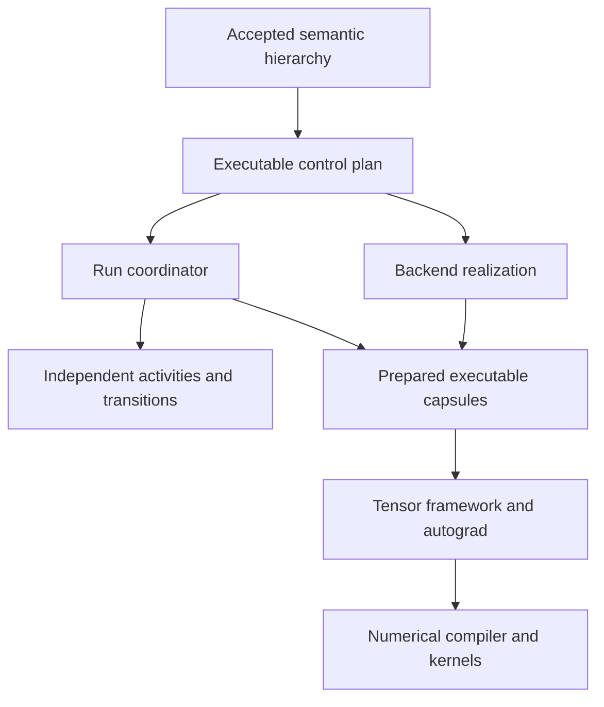

# How deep should a whole-run training graph go?

Exploratory architectural research — 1 October 2026

## Scope and evidence

This investigation preserves one premise: the trainer is organized around a hierarchical semantic whole-run graph. Its public meaning includes participants, invocations, values, state, dependencies, schedules, optimization actions, independently progressing activities, transitions, effects, lifecycle, and restoration relationships. Its public graph need not enumerate tensor mathematics.

Implementation language, graph representation, execution language, tensor framework, and compiler substrate are independent choices. The analysis below first establishes obligations, then pushes several architectures to their failure points, and only then draws a provisional boundary.

Grounding: the supplied design(4).md and training-mechanism-sketch(4).md, and the [model-strategy-trainer branch](https://github.com/Enferlain/sd-scripts/tree/e0a6f9bb2f7299bf576dfdd1cf5a1c6e8c9ac627), pinned at commit e0a6f9bb2f7299bf576dfdd1cf5a1c6e8c9ac627. Their branch counterparts are the [design](https://github.com/Enferlain/sd-scripts/blob/e0a6f9bb2f7299bf576dfdd1cf5a1c6e8c9ac627/openspec/changes/rework-model-strategy-trainer/design.md) and [mechanism sketch](https://github.com/Enferlain/sd-scripts/blob/e0a6f9bb2f7299bf576dfdd1cf5a1c6e8c9ac627/openspec/changes/rework-model-strategy-trainer/research/training-mechanism-sketch.md). Relevant inspected code includes library/training/execution.py, the live training loop, execution-cost probes, and run-language/preparation experiments. The candidate executor is explicitly not the active Trainer. The documents' current Python choices are treated as hypotheses, as requested, rather than constraints on this investigation.

External factual descriptions below link primary documentation, source, or research papers. Architectural judgments are deductions from those descriptions and the requirements; they are not benchmark results. No new GPU, distributed, native-runtime, or compiler benchmark was performed. Existing branch measurements are identified separately.

## 1. First principles: what would a lower layer actually buy?

Moving a responsibility down can mean four different things:

1. Resolve it earlier: validate and specialize before execution.
2. Represent it more explicitly: convert hidden assumptions into dependencies, effects, or state.
3. Execute it with less overhead: remove repeated lookup, interpretation, allocation, or language transitions.
4. Transfer it to a stronger substrate: use an existing compiler, scheduler, communication runtime, or kernel library.

Only the third necessarily concerns native code. A Python-generated function can resolve work earlier. A native interpreter can retain every expensive dynamic lookup. An MLIR dialect can describe very high-level meaning without providing its execution. A tensor compiler can produce native kernels while its controller remains Python.

The project should evaluate a lower boundary against:

- Semantic coverage: can it represent the actual training methods and failure cases?
- Knowable information: what facts are available at preparation, admission, dispatch, and completion?
- Optimization authority: which transformations preserve the required observations and effects?
- Runtime cost: dispatch, callbacks, synchronization, allocation, compilation, recompilation, and retained state.
- Extension cost: can a new research method be expressed with existing constructs and a custom operation?
- Infrastructure ownership: which alias analysis, autograd, buffer management, distributed execution, code generation, and debugging machinery becomes ours?

There is no reason for all five layers to stop at the same depth.

### A hierarchy needs both dataflow and ongoing control

A run is not one acyclic tensor graph. Temporary values can use SSA-like identities, but long-lived state needs owners and versions. Repetition, admission, feedback, and transitions require structured control or activities. One practical representation is a hierarchy containing acyclic value regions, explicit state interfaces, and persistent activity state machines.

Dependencies also have different meanings: a value dependency, an ordering constraint, a state conflict, and a freshness condition are not interchangeable. A producer can finish generating a batch without that batch becoming admissible. A submitted GPU operation can return to the host without device completion. A returned optimizer call does not prove that numerical parameters changed.

These distinctions are obligations of the trainer's semantics. Choosing Rust, C++, Python, or MLIR cannot establish them by itself.

### The useful unit of execution is a region with a contract

An operation or region needs a contract covering inputs and structured outputs, semantic identities, state/effect access, gradient behavior, completion meaning, supported realizations, and relevant restoration policy. A region may contain ordinary framework calls, a compiled numerical program, a pipeline schedule, or custom research code.

Two modes are useful:

- An opaque body with a declared contract. Easy to extend; analysis stops at the contract.
- A transparent body in a supported lower IR. More specialization and fusion become possible inside it.

Arbitrary user code cannot be made statically effect-safe merely by attaching metadata. Guarantees over opaque code are conditional on its contract, supported runtime checks, and backend conformance. This is an extensibility tradeoff, not a reason to require every operation to be compiler-visible.

## 2. Separate the five layers before selecting technology

| Layer | Meaning that must remain explicit | What lowering can resolve | What does not automatically belong here |
|---|---|---|---|
| Semantic IR | Participant identity; invocation/view; value and state relationships; optimization ownership; cadence and progress; activity admission; transitions; effects; recovery relationships | Contract validation, accepted arrangements, permissible alternatives, invalidation dependencies | Every tensor operator, Python object field, CUDA stream, or collective |
| Executable IR / plan | Selected operations; prebound wiring; prepared views; dependency/effect tables; current revision requirements; action and region ownership | Integer slots, callable handles, fixed paths, structured branches, ready indexes, bounded result handling | Reimplementing autograd or allocating framework activation storage |
| Backend lowering | Mapping logical work and subjects to ranks, shards, microbatches, devices, offload and precision representations | Backend-private schedules, wrappers, communication order, placement, executable capsules | Changing loss routing, ownership, cadence, or gradient cuts without semantic authorization |
| Tensor computation | Numerical program and differentiation semantics | Framework eager execution, captured forward/backward programs, tensor transformations | Whole-run policy versions, producer admission, topology publication, partial-mutation recovery |
| Kernels | Operator implementation, fusion, layouts, hardware execution | Triton, CUDA, CPU code, vendor libraries, target-specific tuning | Run authority, optimization-unit identity, or recovery semantics |

Logical scheduling belongs at the first two layers: which action is due, what input is admissible, what progress advances, and which effects exclude each other. Physical scheduling can belong below them: microbatch order, communication overlap, device streams, and kernel launches. The upper graph can select or constrain a physical schedule without implementing it.

Precision and quantization span this boundary. Choosing quantization-aware training versus a detached quantized serving snapshot changes semantics. Implementing an accepted representation with a particular kernel/layout is physical. A backend must not silently turn one into the other.

## 3. Prior art: architectural boundaries, rather than API resemblance

### Tensor compilers are region compilers, not automatically run coordinators

[PyTorch Dynamo](https://docs.pytorch.org/docs/main/user_guide/torch_compiler/torch.compiler_dynamo_overview.html) extracts FX graphs from Python execution using frame interception and guards. Python and compiled execution can coexist. [AOTAutograd and Inductor](https://pytorch.org/get-started/pytorch-2-x/) handle differentiated tensor regions and generated kernels; the [compiler FAQ](https://docs.pytorch.org/docs/stable/user_guide/torch_compiler/torch.compiler_faq.html) explains composition with eager autograd.

The architectural leverage is a numerical compiler beneath a dynamic controller. The trainer's authored semantic graph is a different representation from an FX graph captured from tensor computation. Using FX as storage would not itself supply participant authority, effect ownership, producer admission, or revision semantics.

[Compiled Autograd](https://docs.pytorch.org/tutorials/intermediate/compiled_autograd_tutorial.html) can capture a larger backward program, including cases fragmented by forward graph breaks and hooks, but adds capture/cache overhead and has limitations. It should be tested as a numerical-region option, not promoted to the whole-run scheduler.

Current documentation also changes an older assumption about AOT training. PyTorch 2.14 documents experimental [torch.compile().aot_compile()](https://docs.pytorch.org/docs/2.14/user_guide/torch_compiler/torch.compiler_aot_compile.html): it precomputes compilation, supports autograd-aware training, and reloads as a Python callable. This is distinct from AOTInductor's non-Python deployment path.

The documented [torch.compiler.precompile](https://docs.pytorch.org/docs/2.14/torch.compiler_api.html) can emit Python source plus an acceleration cache, lift model parameters/buffers to runtime inputs, and capture backward. Its default capture specializes control flow and tensor properties; which parameters receive gradients is fixed at capture. These are promising preparation-time executable capsules, with explicit specialization obligations. They do not establish universal C++ deployment of arbitrary research training.

Compiler semantics need checking, not just speed tests. The [compiled-backward documentation](https://docs.pytorch.org/docs/main/user_guide/torch_compiler/torch.compiler_backward.html) describes baked-in backward autocast assumptions and possible silent incorrectness if configured incorrectly. Numerical policy must therefore be part of a capsule's validated contract.

### Distributed frameworks already own valuable physical schedules

[FSDP2](https://docs.pytorch.org/docs/stable/distributed.fsdp.fully_shard.html) provides sharded parameter realization through DTensor and supports offload policies. [PyTorch pipelining](https://docs.pytorch.org/docs/2.14/distributed.pipelining.html) owns stage execution, microbatch schedules, and communication. Its shape/dtype preparation requirements should be checked against the specific API/version; current stage metadata support is more nuanced than a blanket claim that all shapes must always be statically fixed.

[Megatron Core schedules](https://docs.nvidia.com/megatron-core/developer-guide/0.17.0/apidocs/core/core.pipeline_parallel.schedules.html) accept forward/loss callbacks while the selected backend schedule drives forward/backward and pipeline communication. This is particularly relevant: logical ownership of backward need not imply that the top-level trainer makes every physical backward call.

[DeepSpeed's engine](https://deepspeed.readthedocs.io/en/stable/training.html) owns substantial backward/step mechanics. Integrating an engine therefore requires an explicit delegation contract. An adapter must establish whether multiple units, routed losses, independent windows, or custom perturbation regions are supported; naming an engine is not evidence of that compatibility.

[Alpa](https://www.usenix.org/conference/osdi22/presentation/zheng-lianmin), with its [architecture description](https://github.com/alpa-projects/alpa/blob/main/docs/architecture/overview.rst), separates inter-operator partitioning, intra-operator compilation, resharding, and runtime scheduling. The transferable idea is layered logical-to-physical planning. Its automatic parallelization also illustrates the cost of going further: a computational graph, cost model, search, and tensor-compiler integration. A whole-run semantic IR alone does not provide those ingredients.

[SimpleFSDP](https://arxiv.org/abs/2411.00284) demonstrates another possible boundary: make compute and communication visible to an existing compiler for overlap and optimization. This motivates optional transparent physical regions, rather than putting collectives in every public semantic recipe.

### Actor/dataflow systems are closer to independent activities

[TorchForge](https://pytorch.org/blog/introducing-torchforge/) composes logical generator, scorer, and trainer actors while numerical/distributed systems handle their internal work. [Monarch](https://github.com/meta-pytorch/monarch/blob/main/README.md) combines Python actor interfaces with a Rust runtime, supervision, meshes, and communication facilities. Their leverage is coarse distributed coordination around specialized computation. Actor supervision is not rollback of an optimizer that partially mutated state.

[veRL's asynchronous trainer](https://verl.readthedocs.io/en/latest/advance/v1_async_trainer.html) exposes policy lag, buffering/admission behavior, and recovery treatment of generated work. This reinforces that policy-versioned experience is a control/state problem in addition to a model execution problem.

[Ray Compiled Graph](https://docs.ray.io/en/latest/ray-core/compiled-graph/ray-compiled-graph.html) prepares repeated actor DAG execution and communication resources. It shows that a Python-authored graph can have a more specialized execution path without making user computations native. Its advertised task-latency figures concern Ray workloads, not local trainer calls. Static repeated graphs can be useful physical regions; dynamic run revisions still need an outer authority.

[Pathways](https://proceedings.mlsys.org/paper_files/paper/2022/hash/37385144cac01dff38247ab11c119e3c-Abstract.html) uses asynchronous distributed dataflow to coordinate compiled computations. The relevant idea is that host coordination can progress independently from numerical execution. It is not evidence that this project needs a cluster-scale runtime.

[Legion](https://legion.stanford.edu/overview/) separates logical regions and declared task privileges from physical mapping and scheduling. This is a strong model for deriving legal concurrency from effects and ownership. Adopting the runtime would require a sound mapping of framework aliases, autograd lifetimes, and memory ownership; copying its principles is much cheaper than integrating its full data model.

[StarPU](https://starpu.gitlabpages.inria.fr/features.html) schedules heterogeneous codelets with managed data/coherence. It is attractive where that runtime can own the data. Layering a second coherence/placement owner over a tensor framework could instead create conflict.

[Timely Dataflow](https://timelydataflow.github.io/timely-dataflow/chapter_5/chapter_5_2.html) tracks logical progress through timestamps, outstanding work, and frontiers. Its useful lesson is that completion/quiescence in an asynchronous activity graph needs explicit accounting, not one global step counter.

### Compiler infrastructures show useful intermediate boundaries

[MLIR](https://mlir.llvm.org/docs/LangRef/) supports extensible operations, SSA values, blocks, and nested regions. A custom semantic dialect could be very high-level. Its [effect interfaces](https://mlir.llvm.org/docs/Rationale/SideEffectsAndSpeculation/) and [dialect conversion](https://mlir.llvm.org/docs/DialectConversion/) provide infrastructure for analyses and lowering. They do not define trainer effects, prove arbitrary Python contracts, or supply a training runtime.

[xDSL](https://xdsl.dev/) offers a Python implementation of an extensible, MLIR-compatible IR toolkit. It separates the choice to use compiler-style infrastructure from the choice to implement the frontend in C++.

[IREE Stream](https://iree.dev/reference/mlir-dialects/Stream/) lowers tensor-oriented work into resources, asynchronous timepoints, lifetimes, and commands. Its [runtime](https://iree.dev/reference/bindings/c-api/) separates VM control from HAL device execution. This is an excellent example of progressively exposing physical information while retaining layers. It is not an interchangeable implementation of eager PyTorch autograd or run recovery.

[TVM Relax's VM](https://tvm.apache.org/docs/arch/relax_vm.html) uses a small instruction set for control and calls into compiled tensor functions. The key observation is that a VM need not contain tensor mathematics. A trainer VM could similarly execute structured control over opaque capsules, but would still need its own activity, effect, and failure contracts.

[DaCe SDFGs](https://spcldace.readthedocs.io/en/stable/sdfg/ir.html) separate control-flow states from dataflow inside states, including nested graphs and explicit data movement. This supports a hierarchical representation; its state/barrier model is not automatically the semantics of long-lived independent training activities.

### Native tensor access already exists, but deployment runtimes have narrower contracts

[LibTorch's C++ frontend](https://docs.pytorch.org/cppdocs/frontend.html) includes tensor operations, autograd, modules, optimizers, and other facilities. A C++ trainer would not need to rebuild differentiation merely because it stops using Python. It would still need to replace or bridge Python-only model and research machinery.

[NativeRT](https://github.com/pytorch/pytorch/blob/main/torch/nativert/OVERVIEW.md) is documented as a C++ inference engine for exported models, with execution frames, dispatcher/delegate calls, and planning. Its weights are read-only during an invocation. Borrowing its executor patterns is sensible; assuming its inference contract covers mutable optimizer units and arbitrary eager backward is not.

[ExecuTorch](https://docs.pytorch.org/executorch/stable/intro-section.html) includes edge training as well as inference, and has a [training extension](https://github.com/pytorch/executorch/blob/main/docs/source/using-executorch-building-from-source.md). It should not be dismissed as categorically inference-only. Export/runtime support for edge training is nevertheless not evidence of parity with this trainer's dynamic methods, distributed realizations, and recovery requirements.

Alternative tensor ecosystems change the tradeoff. [JAX](https://docs.jax.dev/en/latest/101/state.html) supports explicit state and controlled mutable references under transformation rules; it is not accurately described as having no mutation. [TensorFlow tf.function](https://www.tensorflow.org/guide/function) stages numerical computation and control around its own state and gradient system. [Burn](https://burn.dev/docs/burn/) composes Rust tensor backends, autodiff, and fusion. These can be valid numerical substrates, but require model/operator/extension/distributed/checkpoint coverage to be established. A native frontend does not by itself solve whole-run semantics.

### Where the main boundaries sit

| System family | Program, control, and state | Autograd / compilation | Scheduling and custom extension | Revision boundary |
|---|---|---|---|---|
| PyTorch eager + compile | Python controller; FX/ATen tensor regions; framework model state | Framework autograd; selected forward/backward regions compiled | User Python remains outside unsupported regions; custom ops require compiler/autograd integration if opaque | Guards, recapture, recompilation; trainer revisions are external |
| JAX / TF staging | Staged numerical control and framework state conventions; host controller outside | Framework differentiation and numerical compiler | User numerical work must fit transformations/capture; external work remains outside | Specialization/retracing plus host-managed changes |
| Megatron / pipeline / FSDP | Framework model and optimizer state; backend physical plans | Tensor framework | Backend drives microbatches/communication; callback or module extension | Reprepare/rebuild under external lifecycle authority |
| Alpa | Numerical graph plus cluster/partition descriptions | Existing numerical compiler stack | Parallelization planner and physical executor | New compilation/planning for changed program or deployment |
| Monarch / TorchForge / Ray | Actors/tasks plus controller; owner-local state | Delegated tensor/generation frameworks | Actor runtime schedules coarse work; user code in actors | Outer controller and actor lifecycle; compiled regions rebuilt as needed |
| Legion / StarPU / Timely | Tasks, logical resources, or dataflow with explicit progress | No automatic eager-PyTorch autograd integration | Runtime derives execution from declared relationships; custom tasks/operators | Runtime-specific graph/task/progress model |
| MLIR / xDSL | Extensible representation and passes; chosen dialect defines state/control | Supplied by dialects/lowerers/framework integration | No trainer scheduler supplied merely by adopting the IR | Transform/re-lower under an externally defined publication model |
| IREE / TVM | Compiler program plus VM/resource-level execution | Requires a suitable differentiated program from frontend | VM/runtime invokes lowered functions/device work | Compile/load new artifacts; dynamic inputs under compiled contract |
| NativeRT / ExecuTorch | Exported numerical programs and runtime state contracts | Export/training capabilities must match workload | Native executor and backend delegates | Load/reprepare supported artifacts; whole-run transition remains external |

## 4. Push materially different architectures to their limits

The overhead ratings below are qualitative hypotheses. Callback frequency, operation size, device utilization, and compilation churn matter more than a language label.

### A. Semantic graph interpreted directly in the authoring language

**Clean boundary:** graph traversal calls selected operations; the tensor framework owns tensors and differentiation. Python is one implementation; a native interpreter has the same architectural shape.

**What it buys:** one understandable representation, straightforward dynamic activities/revisions, rapid custom-method development, and excellent semantic tracing. Most validation and effect analysis can happen before traversal.

**Costs:** repeated traversal, dictionary/object access, allocations, and generic result handling can dominate cheap regions. A single central loop can also accidentally serialize independent activities. Python debugger experience is good; distributed causality still needs graph-aware tools.

**Interaction and portability:** eager autograd works naturally across calls; framework/backends remain selectable through operation adapters. A new method implements contracts and operations, not compiler passes.

**Failure point:** using interpretation as the only implementation after dispatch or bookkeeping is measured as a material bottleneck. It is still a valuable reference executor and fallback. Strong semantics do not require it to be the production hot path.

### B. Semantic graph lowered to a specialized host-language execution plan

**Clean boundary:** an accepted graph becomes prebound callable regions and a structured coordination plan. Stable straight-line portions can become generated Python functions; branches, activities, and transitions remain explicit. Typed-Python compilation with tools such as [mypyc](https://mypyc.readthedocs.io/en/latest/) is an additional option.

**What it buys:** eliminate per-call name resolution and slot interpretation; specialize due sets, effects, and result layouts; bind routes once; group framework calls into useful compiler regions. Runtime freshness checks remain where needed.

**Costs:** source generation, invalidation, source maps, and equivalence testing. Generated code must retain exception boundaries and required observations. Flattening all dynamic behavior into one function would lose the main graph benefits.

**Interaction and portability:** framework tensors and autograd remain live objects; no mirrored model state or mandatory FFI. Backend capsules may be Python callables, native calls, or distributed schedules. A new method normally supplies the same contract/body as A.

**Expected overhead:** lower than a generic interpreter for repeated cheap regions, but Python callable bodies, policy decisions, and required reports still cost something. Tensor compilation can remove inner operator dispatch separately.

**Failure point:** host event handling, ready queues, or many tiny dispatches remain significant after specialization; or Python-only deployment is unacceptable. This architecture can then preserve its schema while changing executor.

### C. Python or language-neutral authored IR with a native coordination runtime / small VM

**Clean boundary:** immutable plan records and resource handles enter a native scheduler once; that scheduler owns activity state, ready queues, leases, event completion, and bounded correlation. Coarse capsules execute Python, framework-native, or compiled work.

**What it buys:** efficient event-driven coordination, predictable bookkeeping, reduced interpreter allocation, and native deployment for the controller. A small VM can support call, await/join, branch, loop/region, and explicit effect/action protocols without implementing tensor operators.

**Costs:** a stable capsule ABI, Python callback management, error translation, lifetime/threading rules, trace integration, and packaging. Native code must own coordination state once; maintaining a synchronized Python copy would erase much of the benefit.

**Interaction and portability:** opaque tensor handles can preserve framework ownership. However, arbitrary Python capsules still need Python. A foreign worker thread cannot just invoke Python objects without the correct interpreter/thread discipline. Cancellation must respect outstanding device work.

**Rust versus C++:** Rust is attractive for coordination state machines and resource lifetimes; C++ has the most direct ATen/libtorch integration. Rust tensor integration introduces binding/glue responsibilities. Neither proves correct gradient routing or recovery. Language choice should follow the measured boundary, not precede it.

**New method:** ideally only adds a capsule and declarations. If it must add native opcodes for every optimizer trick or input policy, the runtime has become a research-method whitelist.

**Expected overhead:** native scheduling can be cheap; crossing to Python for each fine-grained node can be slower or more complicated than B. The meaningful metric is boundary crossings per useful region.

**Failure point:** callbacks dominate, mirrored ownership emerges, or semantic features continually require native core changes. Native runtime is justified only where substantial coordination remains native.

### D. Mostly native graph executor with LibTorch or another native tensor framework

**Clean boundary:** native graph objects, control, and framework-backed computation; Python is an optional plugin/capsule source.

**What it buys:** no Python on native paths, direct native tensor/autograd calls, deployment without a Python controller, and potential sharing of handles/metadata without crossing languages.

**Costs:** porting model construction, hooks, adapter mechanisms, optimizers, serializers, custom operations, and research utilities; native build/ABI integration; harder mixed-language debugging. The cost is low only if the required numerical and customization ecosystem already works natively.

**Interaction and portability:** C++ plus ATen can preserve autograd without owning an autodiff engine. Native Rust plus an established tensor backend is a different ecosystem choice; coverage cannot be assumed equivalent. Backend portability follows the tensor substrate's actual capabilities.

**New method:** can remain a Python capsule, but frequent hooks and Python tensor code weaken the Python-free benefit. Fully native methods need the native extension toolchain.

**Expected overhead:** potentially lowest host dispatch when most work is genuinely native. This says little about GPU kernel time or communication efficiency.

**Failure point:** most models and novel methods still depend on Python. At that point D pays porting and FFI costs without eliminating the controller bottleneck. It remains credible for a bounded native deployment profile.

### E. Outer semantic controller with a staged numerical training program

**Clean boundary:** the run graph coordinates activities/revisions; a numerical region compiles forward, losses, gradients, and possibly optimizer transformations. The numerical substrate could be PyTorch, JAX, TensorFlow, or another compiler-backed system.

**What it buys:** optimization across numerical boundaries, fewer launches, explicit numerical state interfaces, and possibly compiled loops/memory planning. A homogeneous repeated action may become one executable.

**Costs:** capture/transform restrictions, variant explosions, compile latency, numerical policy validation, and less internal failure visibility. Porting to another tensor ecosystem is substantial when the model/operator ecosystem is already PyTorch-based.

**New method:** supplies transformable numerical code plus an outer contract. Python side effects, hooks, stateful packing, and arbitrary producer behavior stay outside or require explicit supported intrinsics.

**Expected overhead:** low on stable compiled regions; cold starts, dynamic views, shapes, and changed gradient membership can dominate otherwise.

**Failure point:** forcing the entire run into tensor tracing. Full-action compilation is legitimate when its mutation/reporting contract is compatible. If a fused region cannot expose required per-unit outcomes, either retain those boundaries or conservatively treat its affected state as uncertain on failure; do not invent atomicity.

### F. Custom high-level compiler dialects lowered through MLIR or xDSL

**Clean boundary:** semantic and executable dialects express trainer meaning; passes lower selected regions into existing tensor/runtime dialects or calls.

**What it buys:** reusable verifier/pass infrastructure, nested regions, typed transformations, canonical textual representation, and explicit conversion legality. It can support a language-neutral frontend.

**Costs:** defining dialect semantics, alias/effect models, conversions, runtime entrypoints, debugging/provenance, and Python framework integration. High-level trainer operations are not executable just because they are valid MLIR.

**New method:** either adds an opaque contracted operation, preserving ease but limiting optimization, or extends dialect/lowering support. Requiring compiler changes for routine algorithms is a high extension cost.

**Expected overhead:** representation choice alone predicts none. It depends on the chosen executor and capsule lowering.

**Failure point:** adopting MLIR before there are enough concrete transformations or existing lowerings to amortize it. A dialect whose every operation lowers to a Python callback has gained infrastructure, not necessarily execution performance.

### G. Generate native control code rather than use an interpreter

**Clean boundary:** static structured regions generate host code calling existing runtime/framework entrypoints. Dynamic activity control and revision publication remain runtime-managed.

**What it buys:** remove VM dispatch and permit conventional compiler optimization of control/bookkeeping. Generated Python or compiled typed Python is a cheaper point on the same continuum.

**Costs:** compilation/linking/loading, stable ABI, code-cache eviction, revision latency, source maps, and reproducibility. Native code with Python callbacks still pays those callbacks. Generated numerical kernels belong to a tensor compiler unless there is a compelling unsupported region.

**New method:** contracted opaque calls remain possible; making every body native requires a supported compiler frontend.

**Failure point:** dynamic graph revisions or many small variants cause code-generation churn; ordinary bookkeeping does not justify a new toolchain. Prefer direct specialization before general native code generation.

### H. Reuse an actor/task runtime for the whole-run deployment

**Clean boundary:** the semantic planner deploys participant activities/capsules into an existing actor system; the trainer retains admission, versioning, progress, and transition authority.

**What it buys:** processes, remote execution, supervision, communication, and coarse asynchronous scheduling without implementing those foundations. Especially plausible for experience generation and multi-device deployments.

**Costs:** transport/serialization, runtime constraints, distributed debugging, capability mapping, and another lifecycle system. Passing every tensor operation through a remote task graph would be excessively fine-grained.

**Interaction and portability:** numerical/autograd work stays local to appropriate workers or uses an established distributed training backend. Cross-process tensor values do not automatically preserve an arbitrary eager autograd graph.

**New method:** adds an actor/capsule and contracts. Core changes should be unnecessary unless it introduces a new deployment capability.

**Failure point:** a small local trainer acquires distributed runtime overhead and operational burden without benefiting. Use this as a realization option, not a mandatory execution substrate.

### Comparative ownership and debugging cost

| Architecture | Main optimization opportunity | Extension / debugging cost | Infrastructure now owned |
|---|---|---|---|
| A: direct interpreter | Preparation-time analysis; minimal implementation | Low extension cost; easiest semantic stepping | Graph validation, coordinator, lifecycle and backend contracts |
| B: specialized host plan | Remove generic dispatch; compile selected numerical regions | Low–medium; generated-code provenance needed | Plan compiler and cache/invalidation rules |
| C: native scheduler / VM | Ready/event handling and native bookkeeping | Medium–high FFI/lifetime/debugging cost | ABI, scheduler/VM, native deployment and tracing |
| D: mostly native tensor executor | Native dispatch and Python-free deployment | High if current research/model ecosystem must be ported | Native trainer integration; existing framework still owns autograd |
| E: staged numerical program | Fusion, numerical state and launch reduction | Medium to high capture/compiler debugging; ecosystem-dependent | Region contracts and numerical compiler adapters |
| F: custom MLIR / xDSL | Systematic multi-level transformations | High dialect/lowering cost; better tooling if reused well | Trainer dialect semantics and runtime integration |
| G: generated native control | Remove interpreter dispatch in stable regions | High toolchain/cache/provenance cost | Host code generator and artifact lifecycle |
| H: existing actor runtime | Independent/distributed activity execution | Medium distributed/operational cost | Deployment mapping and trainer-specific semantics, not transport foundations |

## 5. Stress the boundaries against the actual graph

The following requirements discriminate more strongly than forward → loss → backward → step.

| Case | Semantic / executable obligation | Numerical or backend obligation | Architecture that fails if used alone |
|---|---|---|---|
| One participant, multiple roles/views | Stable participant identity distinct from invocation, view, and realization; conflicting mode effects explicit | Correct parameter sharing, requires-grad behavior, adapters, buffers and RNG; compiled variants must match view | Flat object-call DAG; inference runtime treating all weights as immutable constants |
| Multiple losses and structured values | Typed structure/path wiring; explicit loss-to-unit relationships and reduction semantics | Preserve the intended gradient contribution for each unit | Full-action compiler that sums all losses and updates every parameter indiscriminately |
| Gradient cuts and continuation | Distinguish detach, no-grad invocation, gradient-bearing values, and continuation lifetimes | Framework autograd crosses supported region boundaries; saved values remain valid | Serializing every intermediate through a remote actor; assuming frozen implies no-grad |
| Several units due in one action | Independent membership, windows, cadence, progress, outcomes; shared alias ownership validated | Shared-loss backward may be reusable; distinct routed losses require correct restricted gradients | Single optimizer engine adapter without a compatible delegation contract |
| Alternating optimizer schedules | Runtime due policies and prebound alternatives; step/zero rules per unit | Gradient accumulation and numerical optimizer state remain separate | One compiled unconditional step presented as the whole run |
| Long-lived input/experience producers | Independent activity state, readiness/admission, backpressure, fairness, shutdown, correlation | Worker/generation implementation stays local or remote as appropriate | One central blocking action list; a tensor DAG with no lifecycle |
| Stateful packing/mixture policies | Owner state, RNG, cursors, reservations, accepted consumption, restore behavior | Framework dataloaders/workers can implement physical production | Treating next(batch) as a pure function; replaying input after uncertain consumption |
| Policy-versioned experience | Version corresponds to actual generation snapshot/lease; lag and admission rules explicit | Producer must realize a credible pinned policy/encoder state | Version tags supplied without enforcing which weights generated the data |
| Stage changes / graph revision | Prepare, validate, publish, invalidate; preserve/migrate/reset/retire state intentionally | Rebind or recompile only affected realizations | In-place mutation of a supposedly fixed executable graph |
| Model surgery | New subject relationships and parameter sets; optimizer/state migration; old handles retired safely | Framework/backend wrapper and optimizer re-preparation | Native pointer registry that treats object addresses as permanent semantic identities |
| Deliberately coexisting paths | Both paths are accepted structure with explicit identities, sharing and version rules | Keep required capsules/views live; manage shared resources safely | Treating every old path as stale, or every old path as a valid fallback |
| FSDP / pipeline / offload / quantization | Semantic-to-physical mappings and capability checks; lifecycle authority retained | Backend drives supported sharding, microbatching, communication and placement | Universal backend adapter that assumes local eager gradient behavior |
| Ambiguous partial mutation | Correlated attempt and phase state; conservative affected-state classification; recovery cut | Backend reports what it knows; completion may be asynchronous and rank-dependent | Generic task retry or an invented transaction around arbitrary optimizer calls |

### Gradients are a particularly important boundary test

Consider two losses, L1 and L2, and units U1 and U2. If U1 is assigned L1 and U2 is assigned L2, differentiating L1 + L2 with respect to both parameter sets generally gives the wrong routing. The intended contributions must be obtained with supported autograd inputs, separate traversals/graphs, functional gradients, or a compiled program that preserves that routing.

One shared loss can sometimes serve several units with one backward, but different accumulation windows, scaling, and clearing still matter. Disjoint logical membership is not enough when parameters alias physically. Preparation must establish the actual mapping and reject unsupported realizations before execution.

A frozen participant may still transmit derivatives to trainable inputs or side modules. It cannot automatically be lowered to no-grad. A detached self-conditioning draft is different from a gradient-bearing KV cache or another structured continuation. Keeping continuation in one autograd-capable worker/framework avoids reconstructing autodiff ourselves.

Compiled forward calls can participate in framework autograd; it is not necessary to fuse an entire action to preserve differentiation. [PyTorch autograd mechanics](https://docs.pytorch.org/docs/main/notes/autograd.html) also makes clear why saved tensors and shared-graph lifetimes matter. Concurrent backward on shared state is not made safe just by putting it on native threads.

### Effects must extend through the necessary lifetime

A forward may save parameter-dependent tensors for backward. A scheduler cannot always release a participant's read lease immediately after forward and allow an optimizer to mutate those parameters. The relevant exclusion may span a continuation or the entire differentiable region.

Likewise, an adapter mode implemented by mutating a module is a state effect. Two invocations with different modes cannot run concurrently just because their value edges are independent. Immutable functional views could permit more concurrency, but are a different realization with its own cost.

Other conflicts include RNG streams, mutable buffers, optimizer/scaler state, producer policy snapshots, process-group collective order, and offload buffers. Static effect checking can prove legality only to the extent that aliases and effects are known. Preparation adds physical alias information; admission and execution add dynamic checks.

### Granted mutation regions need explicit handback

A SAM-like region may own two forward/backward passes, temporary parameter perturbation, intermediate gradient clearing, and restoration, while the trainer retains final clipping/step/zero authority. Represent that ownership interval explicitly.

An opaque Python or native capsule can implement the region. It must state its completion/handback conditions and uncertain-failure treatment. Native implementation does not make the region atomic. Compiling it is possible when its body and protocol are supported, but compilation must not erase the required mutation boundaries or accidentally move an observation across them.

### Recovery is not ordinary scheduling

Once a mutating call has started, an exception may arrive after some parameters, optimizer statistics, RNG, scaler, or input state changed. Useful outcomes include not attempted, skipped under a known rule, returned, and uncertain. Host return, device completion, and globally agreed distributed success are different observations.

The runtime should stop dependent work when its needed state is uncertain. It should not retry a mutation solely because an actor or task framework offers retries.

An exact restoration cut can involve model and optimizer state, pending gradients and scaling, input/producer cursors and queued work, owner state, RNG, revisions, progress, and inflight-effect treatment. Pausing one producer or saving weights is insufficient. [Distributed Checkpoint](https://docs.pytorch.org/docs/stable/distributed.checkpoint.html) can handle framework state serialization and sharded identities, but the trainer still defines which owners belong to the cut. The documented [staging versus upload completion](https://docs.pytorch.org/docs/main/distributed.checkpoint.html) distinction is another reason to model lifecycle completion explicitly.

The initial practical mechanism can be coordinated quiescent cuts with clearly declared replay/reset policies. It need not be a durable event journal for every tensor call. A journal improves correlation and recovery protocols; it does not create a transaction for unjournaled tensor mutations.

## 6. What becomes possible specifically because of the IR?

The value comes from accepted meaning being available before execution. Native implementation is only one way to exploit that information.

| Capability | Information the IR must supply | Sensible implementation boundary | Limit / infrastructure cost |
|---|---|---|---|
| Ahead-of-time validation | Identities, contracts, effects, ownership, allowed branches and state relationships | Semantic verifier plus preparation checks | Cannot infer arbitrary callable truth or future backend success |
| Prebinding | Resolved operations/views, structured value paths, known action alternatives | Executable-plan compiler | Do not freeze live policy state or bypass freshness |
| Static effect / ownership checks | Resource access, phase ownership, alias relationships | Semantic analysis plus backend alias realization | Physical aliases and unknown Python effects limit proof |
| Dependency-derived scheduling | Value/order/effect edges, admission rules, completion semantics | Coordinator and resource scheduler | A value DAG alone is insufficient |
| Automatic concurrency | Disjoint effects, supported async completion, collective/RNG rules | Coarse activity or capsule scheduling | Autograd and parameter lifetimes can prohibit apparent parallelism |
| Memory planning | Value lifetimes, retained continuations, queue bounds, physical size summaries | Host reference release and admission budgeting; delegate inner buffers | Global activation allocation requires framework/compiler alias and saved-tensor knowledge |
| Graph specialization | Revision, topology, route/view, shape/dtype/layout and policy conditions | Plan variants plus framework compiler guards | Variant proliferation and compile latency can exceed savings |
| Safe caching | Purity or state/version dependence, gradient intent, RNG and freshness | Cache only explicitly supported products/artifacts | A reused tensor with a stale autograd graph is not a safe generic cache |
| Distributed schedule lowering | Accepted gradient/window semantics, backend capabilities and mappings | Select/instantiate existing physical schedules | General auto-partitioning/search requires cost models and a numerical graph |
| Operation fusion | Transparent numerical bodies; preserved observations/effects | Existing tensor compiler inside suitable regions | Opaque calls cannot be fused by wishing; mutation/outcome boundaries constrain fusion |
| Compiled repeated regions | Stable contract and body, guarded variants | Host specialization, tensor compilation, capture, optional VM/native code | Compiler warmup, invalidation, and backward semantics require testing |
| Runtime graph revision | Immutable accepted generations, changed-dependency mapping, state migration | Coordinator publishes validated prepared generation | Destructive surgery may need quiescence; no universal rollback |
| Inspectable execution | Semantic IDs mapped through plans and physical capsules | Graph-aware traces, profiles, source maps and attempt correlation | Instrumentation must be bounded and should avoid unnecessary device synchronization |
| Deterministic execution policy | Explicit choices/order, input correlation and RNG ownership | Optional deterministic scheduling/admission mode | Does not imply bitwise-identical floating-point kernels or distributed reductions |
| Backend code generation | Explicit legal lowering interface and source provenance | Generate calls/plans or use an existing backend compiler | A universal hardware compiler is a separate, expensive project |

### Use two types of cache keys

Compiled code depends on program body, topology, gradient participation, representation/layout, and compiler assumptions. Ordinary weight updates need not invalidate that code if weights are runtime inputs.

Derived products and experience depend on semantic versions of weights, encoders, policy, input state, and freshness rules. They can become stale while the compiled code remains valid. Conflating these invalidation domains would either recompile every step or admit stale products.

### Preserve provenance through lowering

Every physical executable should identify which semantic operation/region, participant/view, unit, revision, and attempt it realizes. One logical action can map to many microbatches or kernels; one compiled region can realize several logical operations.

Profiling and failure reports should traverse that many-to-many mapping. Requiring every physical event to become a public IR node would add complexity without improving the semantic contract.

## 7. Three representations can be enough

A useful architectural decomposition is:

1. **Accepted semantic hierarchy.** Serializable meaning and contracts, stable IDs, state ownership, accepted alternatives, transitions, and restoration relationships. It can be authored in Python, a DSL, or another language.
2. **Backend-neutral executable control plan.** Prebound operations and wiring, structured regions/branches, ready and admission indexes, resource/effect requirements, action outcomes, revisions, and provenance.
3. **Backend-private physical executable.** Framework callables, pipeline schedules, actor deployments, exported programs, compiled numerical regions, or captured launch sequences. These may have internal IRs maintained by existing systems.

There need not be one universal lower IR covering all three. A backend can expose a typed capsule and an inspectable physical summary without serializing all internals into the trainer's schema.

Serializable semantic records should reference registered executable identities and code versions where bodies are opaque. This does not promise portable serialization of arbitrary Python closures or native pointers. Authoring, validation, and execution can use different languages without duplicating mutable runtime authority.

The coordinator and capsule boundary can be Python, native, or mixed. The diagram describes authority and lowering, not a requirement that every call travel through every box. A backend-owned pipeline can execute many microbatches under one capsule invocation.

### A deliberately narrow executable ABI

Before choosing native technology, prototype a capsule interface with:

- Resolved input/output layouts and semantic provenance.
- Framework objects or handles with a single actual owner.
- Declared state/effect requirements, gradient behavior, and supported realization capabilities.
- Preparation guards and runtime validity conditions.
- Synchronous or asynchronous completion with clearly defined milestones.
- Mutation scope and outcome/uncertainty reporting.
- Lifecycle hooks for quiescence, shutdown, re-preparation, and restoration composition.

This is an interface sketch, not a commitment to make every operation a plugin ABI. An in-process Python executor can implement it first. Native/external executors can implement a smaller capability profile.

Do not put live participant, optimizer, and input state into both Python and native registries that each believe they are authoritative. An immutable compiled snapshot of semantic IDs is fine; duplicated mutable ownership is the problem.

### Publication, coexistence, and invalidation

Treat executable generations as immutable. Prepare and validate a new generation, then publish it according to the required ownership/rank protocol. Inflight work retains the generation it was admitted against. Retire old artifacts when their obligations are discharged.

That does not require universal hot swapping. Destructive topology changes may first withdraw readiness and quiesce the affected scope. State preservation, migration, reset, or retirement is an explicit transition decision.

Deliberately coexisting old/new paths can both be accepted within a generation, or governed across generations. They need declared sharing/version rules. A stale pointer or fallback cache entry is not such a rule.

## 8. Performance evidence: what it says and what it does not

The supplied sketch reports the branch's G3.7 CPU probe ([raw results](https://github.com/Enferlain/sd-scripts/blob/e0a6f9bb2f7299bf576dfdd1cf5a1c6e8c9ac627/openspec/changes/rework-model-strategy-trainer/research/execution-cost-results.json)): three independent CPython 3.13.13 processes on WSL2, seven 10,000-call samples per process, GC enabled, matching selected unary-fixture semantics, compilation/startup outside timing.

| Existing measured fixture | Prepared candidate, µs/call | Matched direct Python, µs/call |
|---|---:|---:|
| 1 cheap operation | 4.83 | 2.67 |
| 4 cheap operations | 6.63 | 2.84 |
| 16 cheap operations | 14.41 | 3.57 |
| 4 operations with selected CPU work | 82.06 | 80.86 |

These are medians of process medians, not individual-call latency percentiles. Paired excess for the cheap cases was approximately 2.13, 3.79, and 10.83 µs. The added-CPU-work spreads overlapped; the small difference cannot be precisely attributed to executor overhead.

The ready workflow measured 18.45 µs without worker compute, waiting, gradients, or optimizer mutation. Dormant-action count did not produce a growing trend in that fixture. Sixteen addressed units cost more than two, but these were selected contribution reports, not real optimizer throughput.

The probe gives positive evidence that pre-resolved slots alone do not eliminate interpretation/allocation cost and that specialized direct Python can save it. It gives no evidence that a native runtime is necessary, that the live training loop has regressed, or that the whole-run production requirements are met. The candidate's report retention was drained by the probe; production retention remains a separate issue.

The existing implementation also rebuilds/checks some input structures and iterates slot wiring per execution. Those are concrete opportunities for B. Its coordinator's one-feed, ordered-due test shape does not establish multi-input correlation or independent progress. Completing those semantics may introduce costs absent from the timing.

### Use whole-system economics

If orchestration is fraction f of end-to-end time and it accelerates by factor s, total speedup is:

**1 / ((1 − f) + f / s).**

If f is 1%, eliminating it entirely has an approximately 1.01× ceiling. If f is 20%, the ceiling is 1.25×. These are illustrations, not estimates of this trainer. Conversely, removing an input stall or scheduling bubble can improve device utilization much more than reducing local call overhead.

Compilation also needs amortization. If a variant costs C to prepare and saves Δt per use, it needs roughly C/Δt uses to break even, ignoring cache/memory costs. Revision and shape churn can prevent that. Startup, steady-state throughput, tail latency, device idle time, peak memory, recompilation frequency, and restoration cost should all be measured.

Free-threaded Python is an additional implementation variable, not a promised solution. [CPython's documentation](https://docs.python.org/3/howto/free-threading-python.html) describes extension compatibility and GIL behavior. Process workers, asynchronous capsules, typed-Python acceleration, and an existing actor runtime are alternatives to writing a new native scheduler.

## 9. At each boundary, where does the answer change?

| Responsibility moved lower | Capability / simplification gained | Added cost | Provisional answer |
|---|---|---|---|
| Authoring objects → accepted semantic records | Stable IDs, analysis, serialization, explicit contracts | Schema/verifier and authoring diagnostics | Yes; foundational to the graph premise, independent of language |
| Accepted graph → resolved executable plan | Remove authoring decisions, prebind wiring/views, expose runtime obligations | Plan compiler, invalidation and equivalence checks | Yes; strong leverage at bounded scope |
| Generic plan interpreter → specialized repeated regions | Remove repeated traversal/allocation/dispatch | Generated code or specialized callable construction | Probably yes; supported by the existing cheap-work probe |
| Python coordination → native queues/events/VM | Lower host overhead, native deployment, stronger implementation discipline | ABI, callbacks, lifetime/threading, build/debug burden | Conditional; measure after specialization and real async workloads |
| Entire semantic frontend → native compiler infrastructure | Tooling and cross-language use, possibly large-graph analysis speed | Authoring integration and compiler ecosystem | Conditional; not justified by runtime speed alone |
| Semantic action → existing physical backend schedule | Sharding, pipeline/communication/offload expertise | Explicit capability mapping and lifecycle integration | Yes where semantics fit; reject unsupported combinations |
| Contracted numerical region → existing tensor compiler | Autograd-aware specialization, fusion, launch/memory optimization | Capture limits, guards, compile cost, numerical validation | Selectively yes; region size is experimental |
| Whole arbitrary run → numerical compiler | Potentially one executable | Must encode producers, effects, revisions and recovery in unsuitable machinery | Usually no; retain an outer control authority |
| Control plan → universal tensor-op IR | Uniform analysis of every numeric operation | Autograd, aliasing, operator coverage and backend lowering ownership | No by default; import/delegate an existing tensor IR when needed |
| Tensor framework → custom differentiation/allocator | Maximum control | Duplicated correctness-critical framework machinery | No absent a demonstrated unsupported requirement |
| Existing kernels → custom Triton/CUDA | Fix a concrete numerical bottleneck | Kernel/autograd/precision/device maintenance | Selectively yes after profiling; private numerical backend work |
| Existing distributed runtime → custom collectives/transport | Highly specific optimization/control | Deadlocks, topology, failure, portability and performance engineering | No by default |

This is not a line drawn at one language. It is a boundary around **owned semantics, executable control, and realization contracts**, with selective deeper implementations.

## 10. Prototypes that would discriminate between the remaining choices

Start with one accepted graph and a conformance oracle shared by every executor. Compare implementations that perform the same checks, preserve the same error/mutation boundaries, and retain/report the same information. A faster implementation that drops admission, ownership, or uncertainty handling is not an equivalent alternative.

| Experiment | Variants and workloads | Required observations | Decision it resolves |
|---|---|---|---|
| Dispatch and specialization | Generic interpreter; prebound/generated Python; typed-Python acceleration; minimal native VM/scheduler. 1/4/16 cheap ops, CPU work, tiny GPU regions, representative diffusion training | End-to-end p50/p99 and throughput, allocations/retention, callbacks, synchronization, CPU/device profiles; cold versus warm; several processes | Whether B suffices and whether C/G buy meaningful total performance |
| Numerical region size | Eager; compile per invocation; model/objective regions; full compatible action; current AOT training/precompile; Compiled Autograd; partial CUDA capture where valid | Gradient/loss/optimizer-state equivalence, compile time/count, graph breaks, cache variants, peak memory, numerical precision policy | Best compiler boundary; whether complete numerical actions are worthwhile |
| Shared views and routed gradients | Shared backbone used as teacher/student; detached draft; KV continuation; frozen gradient conduit; two units with same and distinct losses/windows | Exact intended gradient paths, accumulation/zeroing, physical aliases and unsupported-capability rejection | Whether capsules/autograd/backend contracts are expressive enough |
| Independent activities | Out-of-order multi-input producers, queue pressure, policy lag, slow/unready actions; Python async/processes versus native/existing actor runtime | No unrelated head-of-line blocking, fair admission, credible policy version, bounded queues/state, shutdown/quiescence, throughput under stalls | Whether specialized Python coordination is enough; when external/native scheduling pays |
| Physical realization | Local oracle → DDP/FSDP2 → pipeline; offload and quantized views as separate supported profiles | Logical-to-physical subject mapping, supported unit/window routing, collective order, progress equivalence, memory/device utilization | Adapter scope versus backend-owned schedule; unsupported semantics caught before mutation |
| Revisions and surgery | Route-only replacement; objective change; model/adapter topology change; old/new coexisting paths; optimizer migration/reset | Selective invalidation, coherent publication, stale-input handling, retirement, weight-update compilation reuse, transition latency | Whether immutable executable generations work and whether native code churn is excessive |
| Partial-failure injection | Before mutation, between unit steps, after async enqueue, during scheduler/zero, perturb/restore handback, producer shutdown, rank loss | Correct known/uncertain outcomes; no blind retry; halted dependent work; restoration from a declared coherent cut | Strength of execution guarantees across each runtime |
| Extension budget | Implement an unseen perturbation method, side trainable, stateful packing policy, asynchronous experience source, and new optimizer schedule | Amount of recipe/capsule code, native/compiler core changes, build burden, diagnostics quality | Whether lower implementation has become an unmaintainable algorithm whitelist |
| Compiler-infrastructure trial | Small custom IR versus xDSL/MLIR for two real passes, e.g. region specialization and effect-aware legal scheduling | Lines/complexity of code, diagnostics, provenance, testability, actual lowering reuse | Whether F simplifies the project enough to justify adoption |

For CUDA capture, use the [framework's capture rules](https://docs.pytorch.org/docs/stable/notes/cuda.html) and [autograd-aware graphed callables](https://docs.pytorch.org/docs/stable/generated/torch.cuda.make_graphed_callables.html). Capture can remove launch overhead in a stable region; it does not replay Python admission or revision logic. Shape/address/lifetime and optimizer capture compatibility are part of readiness.

For selective kernels, use the [custom-operator integration](https://docs.pytorch.org/tutorials/advanced/custom_ops_landing_page.html) and [Triton integration](https://docs.pytorch.org/tutorials/recipes/torch_compile_user_defined_triton_kernel_tutorial.html) appropriate to the framework. Measure the original numerical bottleneck first, and preserve gradient/compiler behavior. Kernel work need not change the public semantic IR.

Acceptance should include semantic gates and measured performance budgets for each matched scope. Do not choose a language from a synthetic nanosecond comparison. Choose it from the smallest boundary that remains costly in representative execution or from a concrete deployment requirement.

## 11. Architectural dead ends and conditions that could rescue them

- **A flat tensor DAG as the sole run representation.** It loses independent lifecycle, owned state, transitions and ambiguous effects. It is useful inside numerical regions.
- **Whole-run torch.compile as the semantic authority.** Tracing executed tensor paths is not accepting run meaning. It is useful beneath a separately governed controller.
- **A native interpreter that calls Python at every fine-grained instruction.** It adds ABI/thread/lifetime work while leaving the bodies dynamic. Coarse capsules or truly native paths can rescue it.
- **Mirrored mutable Python/native state.** It creates synchronization and split authority. Immutable semantic snapshots plus singly owned live state avoid that problem.
- **A native opcode for every training technique.** It makes novelty a core-runtime modification. Small generic control/effect primitives plus contracted capsules preserve research extensibility.
- **MLIR chosen because it sounds like the lowest IR.** A high-level dialect is possible, but the trainer still owns semantics and runtime integration. Actual pass reuse and lowerings are the reason to adopt it.
- **A new universal tensor compiler, autograd engine, allocator, and distributed runtime.** It is a framework project disguised as a trainer. A concrete unsupported numerical feature may justify a narrow extension, not replacing the entire stack.
- **Every tensor operation as a remote actor/task.** Transport, ownership, and autograd boundaries overwhelm useful work. Independent producers or coarse numerical services are suitable actor units.
- **Automatic concurrency from value edges alone.** Aliases, saved tensors, RNG, mutable views and collectives can invalidate it. Effect-aware scheduling can enable specific safe concurrency.
- **Automatic retry or all-or-nothing optimizer actions.** Existing task/runtime failure mechanisms do not make arbitrary state mutation atomic. Explicit uncertainty and coherent recovery are required.
- **No executable specialization because Python is sufficiently fast.** This is also premature: the branch already shows avoidable overhead on cheap fixtures. Measure and specialize before deciding whether to go native.
- **Universal backend portability without capability restrictions.** Semantics such as routed gradients and independent accumulation windows may not map to every engine. Supported profiles and early rejection are more maintainable than silent approximations.

## 12. Provisional conclusion: the lowest sensible ownership boundary

### Lowest level worth owning ourselves

Own a **backend-neutral executable control plan and its coordination semantics**, in addition to the accepted semantic IR. That includes verification, selected operations and prepared views, value wiring, due/admission logic, resource/effect ownership, outcomes, activity coordination, graph-generation publication, invalidation, and restoration composition.

Own the logical-to-physical contract and selected backend adapters. A backend-private schedule may be imperative Python, a native task plan, or an existing backend object; it need not become a universal public IR.

This is a small domain-specific control compiler/runtime, not merely a configuration graph. Keeping it bounded requires delegating numerical and physical machinery deliberately.

### What should execute it?

The likely first implementation to prototype is an inspectable semantic frontend plus specialized host execution, with framework-backed numerical capsules and supported backend-owned distributed schedules. Python is the strongest initial candidate given this branch's existing models and customization ecosystem, not a consequence of the graph premise.

Keep the canonical identities/contracts independent of Python object identity and keep the capsule boundary coarse enough to change executors. Test a native coordinator or small VM against that same interface where ready/event/bookkeeping pressure is real. C++ is plausible for direct ATen-heavy execution; Rust is plausible for mostly native coordination. Typed-Python acceleration and existing actor systems belong in the comparison.

On a typical accelerator deployment, run coordination executes on host CPUs, locally or across controller/workers. Numerical capsules execute through a tensor framework's autograd and physical backend. Compilers generate CPU/GPU programs and kernels where profitable; eager paths remain valid elsewhere. There is no need for one universal substrate to execute every layer.

### Layers existing frameworks should retain

Retain framework responsibility for tensor objects, differentiation and saved-tensor semantics, operator dispatch, numerical compiler passes, allocator/buffer details, device execution, and standard communication/sharding/pipeline mechanisms. Use checkpoint facilities for their supported physical state serialization while the trainer defines the restoration cut.

Selective Triton/CUDA or compiler extensions are justified by demonstrated numerical bottlenecks. They belong beneath numerical contracts, not in the whole-run language.

### Promising prototype portfolio

1. A semantic reference interpreter and a specialized host-plan executor sharing conformance tests.
2. The same plan with alternative numerical capsule boundaries: eager, compiled, AOT training, and capture where supported.
3. A narrow native coordinator/VM or existing actor runtime for a genuinely asynchronous workload, compared against optimized host coordination.
4. A small xDSL/MLIR trial only if concrete transformations show that compiler infrastructure reduces our code and improves diagnostics.

Mostly native LibTorch execution remains an option for a bounded deployment/model profile. A staged alternative tensor ecosystem remains an option if its model and research-extension coverage proves worthwhile. Neither should be selected merely to make the language stack uniform.

### The point where “yes” changes to “no”

Moving from semantic description to **resolved, specialized control execution** buys enough analyzability, correctness and avoidable-overhead reduction to be worth owning. Moving further into **generic tensor/autograd/compiler/device machinery** does not currently have comparable justification, because mature substrates already provide it and the whole-run IR lacks the detailed numerical information needed to replace it.

Native coordination sits between those judgments: plausible, testable, and conditional. The graph should reach deeper through verified mappings, contracts and provenance than the project should implement deeper itself.

That boundary preserves the central advantage of the proposed IR: the trainer can know and govern what the run means while allowing different parts of that run to execute on the machinery best suited to them.
